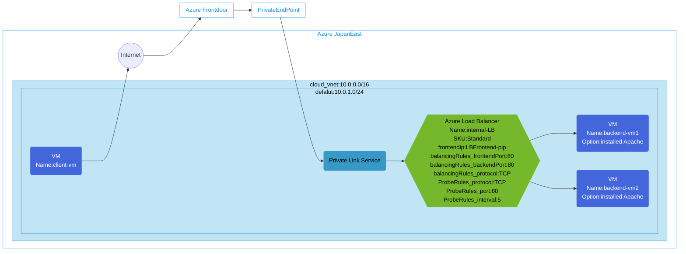

This template deploys a Front Door Premium with a virtual machine web server origin. Front Door uses a private endpoint, configured with Private Link service, to access the web application.

```mermaid
graph LR;
%% Groups and Services
subgraph GR1[Azure JapanEast]
    IT((Internet))
  subgraph GV1[cloud_vnet:10.0.0.0/16]
      subgraph GVS2[defalut:10.0.1.0/24]
        CP1("VM<br/>Name:client-vm")
        PLS("Private Link Service")
        ALB{{"Azure Load Balancer<br/>Name:internal-LB<br/>SKU:Standard<br/>frontendip:LBFrontend-pip<br/>balancingRules_frontendPort:80<br/>balancingRules_backendPort:80<br/>balancingRules_protocol:TCP<br/>ProbeRules_protocol:TCP<br/>ProbeRules_port:80<br/>ProbeRules_interval:5"}}
        CP2("VM<br/>Name:backend-vm1<br/>Option:installed Apache")
        CP3("VM<br/>Name:backend-vm2<br/>Option:installed Apache")
      end
end
end
subgraph GR2 [Azure Frontdoor]
end
subgraph GR3 [PrivateEndPoint]
end


%% Relation for resources
CP1 ---> IT ---> GR2 --> GR3 --> PLS --> ALB
ALB ---> CP2
ALB ---> CP3

%% Groups style
classDef GSR fill:#fff,color:#1490df,stroke:#1490df
class GR1,GR2,GR3 GSR

classDef SGV1 fill:#c1e5f5,color:#000,stroke:#1490df
class GV1,GV2,GVS1,GVS2,GVS3,GVS4 SGV1
 
%% Service Style
classDef SCP fill:#4466dd,color:#fff,stroke:none
class CP1,CP2,CP3 SCP

classDef SVPPLS fill:#3999c6,color:#000,stroke:none
class PLS SVPPLS

classDef SVPALB fill:#76b82c,color:#000,stroke:none
class ALB SVPALB

classDef SLNGW fill:#70b126,color:#fff,stroke:none
class LNGW1,LNGW2 SLNGW

```
