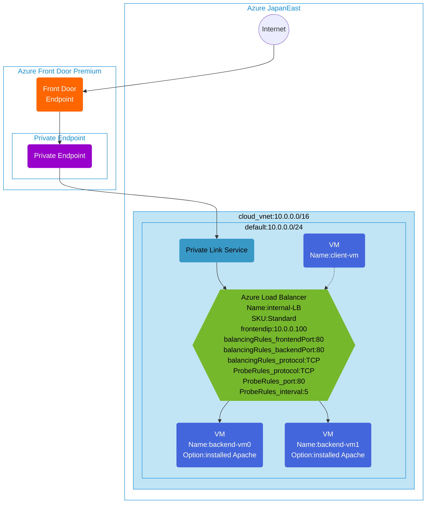

## Architecture
This template deploys Azure Front Door Premium with a virtual machine web server origin. Front Door uses a private endpoint, configured with Private Link service, to access the web application hosted on backend VMs via an internal Standard Load Balancer.



## Features of the template

- Deploys Azure Front Door Premium with global endpoint for high availability and performance
- Creates a Standard SKU internal Azure Load Balancer with private frontend IP (10.0.0.100)
- Sets up Private Link Service to securely connect Front Door to internal load balancer
- Configures private endpoint for secure, private connectivity from Front Door
- Creates 2 backend virtual machines with Apache web server installed via cloud-init
- Configures TCP load balancing rules for port 80 with health probes
- Creates a client VM for internal testing of the load balancer
- All resources are deployed in a single virtual network with appropriate subnet configuration
- Optionally enables diagnostic logging with Log Analytics workspace
- Uses network security groups to protect virtual network resources

## Usage

### Prerequisites
- Azure subscription
- Resource group created in a supported region
- Contributor access to the resource group
- Azure CLI or PowerShell installed for deployment

### Deployment

1. Clone the repository containing the Bicep templates
2. Navigate to the afd-pls-lb-wevserver-env directory
3. Update the parameter.json file with your own values:
   - locationSite1: Azure region for deployment (default: japaneast)
   - vmAdminUsername: Username for the VMs
   - vmAdminPassword: Password for the VMs
   - enablediagnostics: Set to true/false to enable diagnostic logging

4. Deploy using Azure CLI:
   ```bash
   az login
   az group create --name <your-resource-group> --location <location>
   az deployment group create --resource-group <your-resource-group> --template-file main.bicep --parameters parameter.json
   ```

   Or deploy using PowerShell:
   ```powershell
   Connect-AzAccount
   New-AzResourceGroup -Name <your-resource-group> -Location <location>
   New-AzResourceGroupDeployment -ResourceGroupName <your-resource-group> -TemplateFile main.bicep -TemplateParameterFile parameter.json
   ```

5. Verify the deployment in the Azure Portal by checking:
   - The Azure Front Door configuration and endpoint
   - The Private Link Service configuration
   - The internal load balancer configuration
   - Backend pool with the two Apache VMs
   - Health probe settings and load balancing rules
   - Virtual network and subnet configuration
