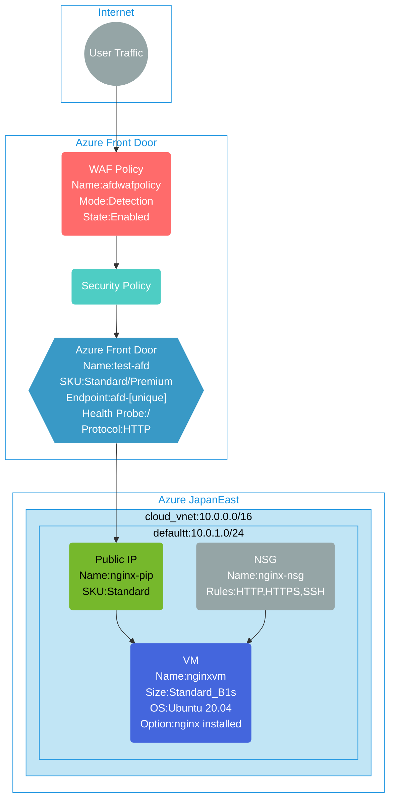

## Architecture
This template deploys Azure Front Door with Web Application Firewall (WAF) v2 protection and an Ubuntu virtual machine running nginx as the origin server. The WAF provides security protection for web applications while Front Door provides global load balancing and acceleration.



## Features of the template

- Deploys Azure Front Door with Standard or Premium SKU for global load balancing and acceleration
- Creates Web Application Firewall (WAF) v2 policy with detection mode for security protection
- Configures security policy to associate WAF with Front Door endpoint for all traffic patterns (*/*)
- Deploys Ubuntu 20.04 LTS virtual machine with nginx web server automatically installed
- Creates public IP address with Standard SKU for the nginx VM
- Configures Network Security Group (NSG) with rules for HTTP (80), HTTPS (443), and SSH (22)
- Uses cloud-init to automatically install and configure nginx on VM startup
- Sets up Front Door origin pointing to the VM's public IP address
- Configures health probe settings for origin monitoring on root path (/)
- Enables HTTP-only forwarding protocol for the origin connection
- Provides Front Door endpoint hostname for accessing the nginx web server globally

## Usage

### Prerequisites
- Azure subscription
- Resource group created in a supported region
- Contributor access to the resource group
- Azure CLI or PowerShell installed for deployment

### Deployment

1. Clone the repository containing the Bicep templates
2. Navigate to the afd-wafv2-nginx directory
3. Update the parameter.bicepparam file with your own values:
   - locationSite1: Azure region for deployment (default: japaneast)
   - vmAdminUsername: Username for the virtual machine
   - vmAdminPassword: Password for the virtual machine (must meet Azure complexity requirements)
   - frontDoorSkuName: Choose between Standard_AzureFrontDoor or Premium_AzureFrontDoor
   - frontDoorEndpointName: Name for the Front Door endpoint (default: auto-generated)

4. Deploy using Azure CLI:
   ```bash
   az login
   az group create --name <your-resource-group> --location <location>
   az deployment group create --resource-group <your-resource-group> --template-file main.bicep --parameters parameter.bicepparam
   ```

   Or deploy using PowerShell:
   ```powershell
   Connect-AzAccount
   New-AzResourceGroup -Name <your-resource-group> -Location <location>
   New-AzResourceGroupDeployment -ResourceGroupName <your-resource-group> -TemplateFile main.bicep -TemplateParameterFile parameter.bicepparam
   ```

5. Verify the deployment in the Azure Portal by checking:
   - The Azure Front Door configuration and endpoint
   - The WAF policy configuration and rules
   - The security policy association with Front Door
   - The virtual machine and its nginx installation
   - The public IP address assigned to the VM
   - Network Security Group rules allowing web traffic
   - Health probe settings and origin configuration

6. Test the deployment by accessing the Front Door endpoint URL to see the nginx welcome page served through Azure Front Door with WAF protection.