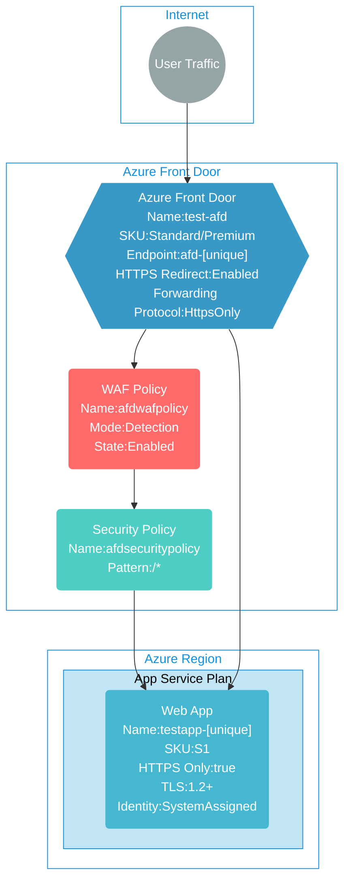

## Architecture
This template deploys Azure Front Door with Web Application Firewall (WAF) v2 protection and Azure App Service web apps. The WAF provides security protection for web applications while Front Door provides global load balancing and acceleration.



## Features of the template

- Deploys Azure Front Door with Standard or Premium SKU for global load balancing and acceleration
- Creates Web Application Firewall (WAF) v2 policy with detection mode for security protection
- Configures security policy to associate WAF with Front Door endpoint for all traffic patterns (*/*)
- Deploys Azure App Service plan with configurable SKU (default: S1) and capacity
- Creates a web application with system-assigned managed identity
- Enforces HTTPS-only access with automatic HTTP to HTTPS redirection
- Configures minimum TLS version 1.2 for enhanced security
- Sets up IP security restrictions to allow traffic only from Azure Front Door backend
- Uses Front Door ID header validation for additional security
- Enables detailed logging, HTTP logging, and request tracing for diagnostics
- Configures health probe settings for origin monitoring
- Provides outputs for both App Service hostname and Front Door endpoint hostname

## Usage

### Prerequisites
- Azure subscription
- Resource group created in a supported region
- Contributor access to the resource group
- Azure CLI or PowerShell installed for deployment

### Deployment

1. Clone the repository containing the Bicep templates
2. Navigate to the afd-wafv2-webapps directory
3. Update the parameter.bicepparam file with your own values:
   - locationSite1: Azure region for deployment (default: japaneast)
   - appName: Name for the web application (default: auto-generated)
   - appServicePlanSkuName: SKU for the App Service plan (default: S1)
   - appServicePlanCapacity: Number of instances (default: 1)
   - frontDoorSkuName: Choose between Standard_AzureFrontDoor or Premium_AzureFrontDoor
   - frontDoorEndpointName: Name for the Front Door endpoint (default: auto-generated)

4. Deploy using Azure CLI:
   ```bash
   az login
   az group create --name <your-resource-group> --location <location>
   az deployment group create --resource-group <your-resource-group> --template-file main.bicep --parameters parameter.bicepparam
   ```

   Or deploy using PowerShell:
   ```powershell
   Connect-AzAccount
   New-AzResourceGroup -Name <your-resource-group> -Location <location>
   New-AzResourceGroupDeployment -ResourceGroupName <your-resource-group> -TemplateFile main.bicep -TemplateParameterFile parameter.bicepparam
   ```

5. Verify the deployment in the Azure Portal by checking:
   - The Azure Front Door configuration and endpoint
   - The WAF policy configuration and rules
   - The security policy association with Front Door
   - The App Service plan and web application
   - IP security restrictions allowing only Front Door traffic
   - Health probe settings and origin configuration
   - HTTPS redirection and TLS configuration