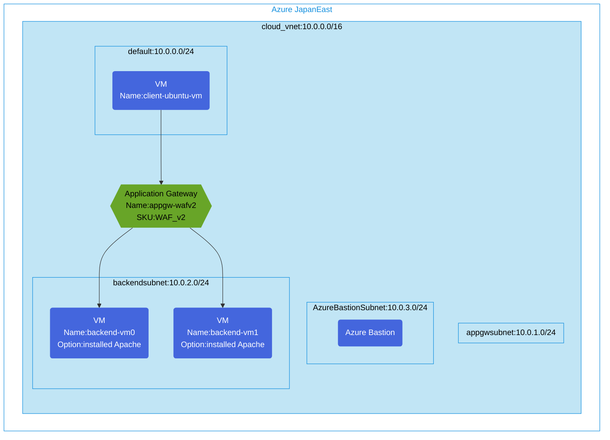

## Application Gateway (WAFv2) with Apache Backends

Configure Application Gateway (WAFv2) using Ubuntu VM (Apache) backend. Diagnostic logs and bastion are optionally deployable.



## Features of the template

- Deploys a WAF_v2 SKU Azure Application Gateway
- Creates 2 backend virtual machines with Apache web server installed
- Configures HTTP routing rules to direct traffic to the backend pool
- Sets up health probe to monitor backend server availability
- Creates a client VM for testing the application gateway
- All resources are deployed in a single virtual network with appropriate subnets
- Optional: Enables diagnostic logs with Log Analytics Workspace
- Optional: Deploys Azure Bastion for secure VM access

## Usage

### Prerequisites
- Azure subscription
- Resource group created in a supported region
- Contributor access to the resource group
- Azure CLI or PowerShell installed for deployment

### Deployment
1. Clone this repository:
   ```
   git clone https://github.com/toizumi03/bicep-templates.git
   ```
   
2. Navigate to the directory:
   ```
   cd bicep-templates/appgw-wafv2-backend-vm-installed-apache-env1
   ```
   
3. Update the parameter file with your own values:
   - Set a secure password for vmAdminPassword
   - Modify other parameters as needed

4. Deploy using Azure CLI:
   ```
   az login
   az group deployment create --resource-group <your-resource-group> --template-file main.bicep --parameters parameters.json
   ```
   
5. Verify the deployment in the Azure Portal by checking:
   - Application Gateway configuration
   - Backend pool with Apache VMs
   - Health probe settings
   - Routing rules
   - Client VM connectivity