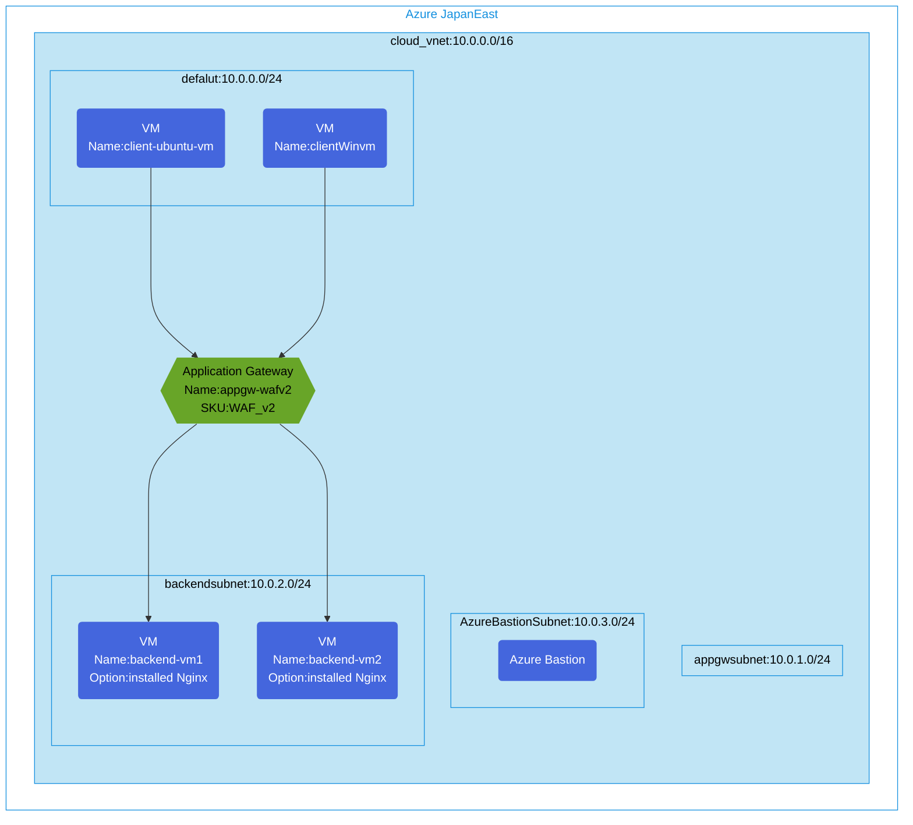

Configure Application Gateway (WAFv2) using Ubuntu VM (Nginx) backend.
Diagnostic log and bastion are optionally deployable.

```mermaid
graph TB;
%% Groups and Services
subgraph GR1[Azure JapanEast]
  subgraph GV1[cloud_vnet:10.0.0.0/16]
      subgraph GVS1[defalut:10.0.0.0/24]
      CP1("VM<br/>Name:client-ubuntu-vm")
      CP2("VM<br/>Name:clientWinvm")
      end
     APPGW{{"Application Gateway<br/>Name:appgw-wafv2<br/>SKU:WAF_v2"}}
          subgraph GVS4[appgwsubnet:10.0.1.0/24]
      end
            subgraph GVS3[AzureBastionSubnet:10.0.3.0/24]
        CP3("Azure Bastion")
      end
      subgraph GVS2[backendsubnet:10.0.2.0/24]
        CP4("VM<br/>Name:backend-vm1<br/>Option:installed Nginx")
        CP5("VM<br/>Name:backend-vm2<br/>Option:installed Nginx")
      end
end
end

%% Relation for resources
CP1 ---> APPGW
CP2 ---> APPGW
APPGW ---> CP4
APPGW ---> CP5

%% Groups style
classDef GSR fill:#fff,color:#1490df,stroke:#1490df
class GR1,GR2 GSR

classDef SGV1 fill:#c1e5f5,color:#000,stroke:#1490df
class GV1,GVS1,GVS2,GVS3,GVS4 SGV1

classDef SGV2 fill:#c1e5f5,color:#000,stroke:#1490df
class GV2 SGV2
 
%% Service Style
classDef SCP fill:#4466dd,color:#fff,stroke:none
class CP1,CP2,CP3,CP4,CP5 SCP

classDef SVPAPPGW fill:#68a528,color:#000,stroke:none
class APPGW SVPAPPGW

```
