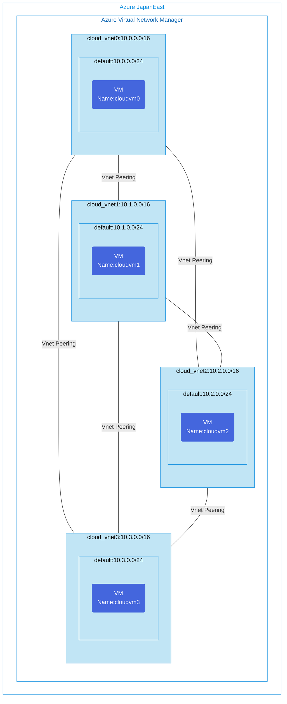

## Architecture
Mesh network configuration using Azure Virtual Network Manager (AVNM).



## Features of the template

- Creates a full mesh network topology managed by Azure Virtual Network Manager (AVNM)
- Deploys 4 virtual networks (10.x.0.0/16) with VMs in each network
- Configures mesh connectivity through AVNM's connectivity configuration
- Enables every VNet to connect directly with all other VNets in the network group
- Enables centralized network management with AVNM network groups
- Automatically provisions the necessary identity and permissions for deployment
- Configures direct peering between all virtual networks in the mesh

## Implementation details

- Uses Bicep modules for modular and reusable deployment
- Deploys multiple VNets using a for loop with dynamic addressing (10.{i}.0.0/16)
- Provisions Ubuntu 20.04 VMs in each network with public IPs for accessibility
- Implements Azure Virtual Network Manager to centralize network governance
- Creates network groups in AVNM to organize virtual networks
- Configures mesh connectivity topology through AVNM's connectivity configuration
- Uses deployment scripts with managed identity to apply network configurations
- Assigns Contributor role to the deployment identity for network management operations

## Usage

### Prerequisites
- Azure subscription
- Resource group created in a supported region
- Contributor access to the resource group
- Azure CLI or PowerShell installed for deployment

### Deployment

1. Clone the repository containing the Bicep templates
2. Navigate to the avnm-mesh-topology directory
3. Update the parameter.json file with your own values:
   - locationSite1: Azure region for deployment (default: japaneast)
   - vmAdminUsername: Username for the VMs
   - vmAdminPassword: Password for the VMs

4. Deploy using Azure CLI:
   ```bash
   az login
   az group create --name <your-resource-group> --location <location>
   az deployment group create --resource-group <your-resource-group> --template-file main.bicep --parameters parameter.json
   ```

   Or deploy using PowerShell:
   ```powershell
   Connect-AzAccount
   New-AzResourceGroup -Name <your-resource-group> -Location <location>
   New-AzResourceGroupDeployment -ResourceGroupName <your-resource-group> -TemplateFile main.bicep -TemplateParameterFile parameter.json
   ```

5. Verify the deployment in the Azure Portal by checking:
   - Virtual networks and peering connections
   - Virtual network manager configuration
   - Network groups and connectivity configurations
