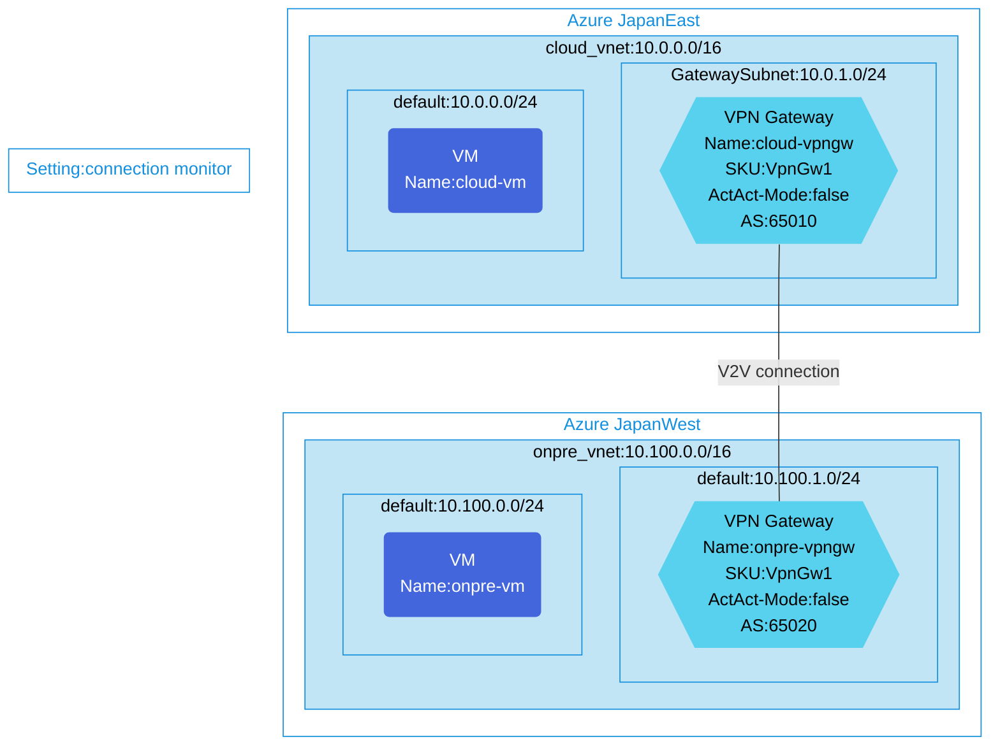

## Architecture

S2S VPN configuration using BGP and connection monitor between virtual machines in different regions.



## Features of the template

- Sets up a Site-to-Site VPN connection between two virtual networks in different Azure regions (JapanEast and JapanWest)
- Configures BGP (Border Gateway Protocol) routing between the VPN gateways
- Deploys VpnGw1 SKU VPN gateways in both regions
- Creates virtual machines in each region for connectivity testing
- Implements Azure Network Watcher Connection Monitor to track connectivity between VMs
- Configures necessary NSGs (Network Security Groups) for secure communication
- Provides diagnostic logging capabilities when enabled

## Usage

### Prerequisites
- Azure subscription
- Resource group created in supported regions (JapanEast and JapanWest)
- Contributor access to the resource group
- Azure CLI or PowerShell installed for deployment
- Azure Network Watcher enabled in the regions you plan to deploy to

### Deployment

1. Clone the repository containing the Bicep templates
2. Navigate to the connection-monitor-azureToOnpre directory
3. Update the parameter.json file with your own values:
   - locationSite1: Azure region for the cloud site (default: japaneast)
   - locationSite2: Azure region for the on-premises simulation site (default: japanwest)
   - vmAdminUsername: Username for the VMs
   - vmAdminPassword: Password for the VMs
   - enablediagnostics: Set to true/false to enable/disable diagnostic logs

4. Deploy using Azure CLI:
   ```bash
   az login
   az group create --name <your-resource-group> --location <primary-location>
   az deployment group create --resource-group <your-resource-group> --template-file main.bicep --parameters parameter.json
   ```

   Or deploy using PowerShell:
   ```powershell
   Connect-AzAccount
   New-AzResourceGroup -Name <your-resource-group> -Location <primary-location>
   New-AzResourceGroupDeployment -ResourceGroupName <your-resource-group> -TemplateFile main.bicep -TemplateParameterFile parameter.json
   ```

5. Verify the deployment in the Azure Portal by checking:
   - The S2S VPN connection between the two virtual networks
   - BGP routing configuration on both VPN gateways
   - Connection Monitor setup in Network Watcher
   - Connectivity between the cloud-vm and onpre-vm virtual machines
