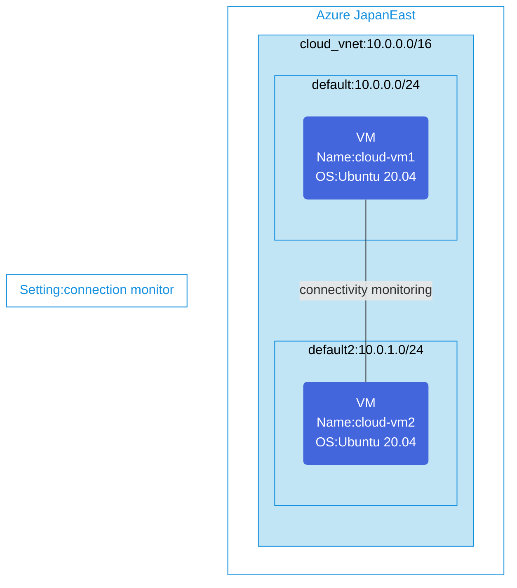

## Architecture
Intra-VNet connection monitoring between two VMs in the same virtual network.



## Features of the template

- Deploys a single virtual network with two subnets (10.0.0.0/24 and 10.0.1.0/24)
- Creates 2 Ubuntu 20.04 virtual machines in different subnets with public IPs
- Configures Network Watcher extension on both VMs for connectivity monitoring
- Sets up Azure Network Watcher Connection Monitor to test SSH connectivity between the VMs
- Connection monitor tests are performed every 30 seconds using TCP protocol
- Network Security Group applied to both subnets with default security rules

## Usage

### Prerequisites
- Azure subscription
- Resource group created in a supported region
- NetworkWatcherRG resource group must exist (created automatically when Network Watcher is enabled in the region)
- Contributor access to the resource group
- Azure CLI or PowerShell installed for deployment

### Deployment

1. Clone the repository containing the Bicep templates
2. Navigate to the connection-monitor-inVnet directory
3. Update the parameter.json file with your own values:
   - locationSite1: Azure region for deployment (default: japaneast)
   - vmAdminUsername: Username for the VMs
   - vmAdminPassword: Password for the VMs

4. Deploy using Azure CLI:
   ```bash
   az login
   az group create --name <your-resource-group> --location <location>
   az deployment group create --resource-group <your-resource-group> --template-file main.bicep --parameters parameter.json
   ```

   Or deploy using PowerShell:
   ```powershell
   Connect-AzAccount
   New-AzResourceGroup -Name <your-resource-group> -Location <location>
   New-AzResourceGroupDeployment -ResourceGroupName <your-resource-group> -TemplateFile main.bicep -TemplateParameterFile parameter.json
   ```

5. Verify the deployment in the Azure Portal by checking:
   - The two VMs with Network Watcher extension installed
   - Connection monitor in the NetworkWatcherRG resource group
   - Connection monitoring tests between the source and destination VMs