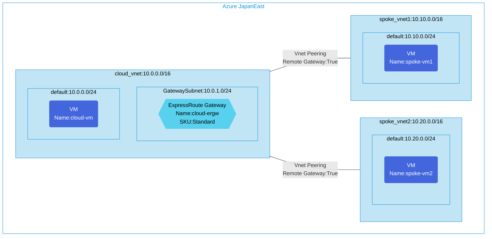

## Architecture
Hub and Spoke configuration with ExpressRoute Gateway. This architecture provides a central hub virtual network that connects to on-premises networks via ExpressRoute, with multiple spoke virtual networks connected to the hub.



## Features of the template

- Implements a Hub and Spoke network topology with ExpressRoute connectivity
- Creates a hub virtual network with an ExpressRoute Gateway for connecting to on-premises networks
- Deploys two spoke virtual networks peered to the hub network
- Configures VNet peering to allow gateway transit from hub to spokes
- Enables remote gateway usage for spoke networks
- Deploys Ubuntu 20.04 virtual machines in each network for connectivity testing
- Applies network security groups to protect the virtual networks
- All resources are deployed in a single Azure region

## Usage

### Prerequisites
- Azure subscription
- Resource group created in a supported region
- Contributor access to the resource group
- Azure CLI or PowerShell installed for deployment
- An ExpressRoute circuit (for connecting to on-premises, not included in this template)

### Deployment

1. Clone the repository containing the Bicep templates
2. Navigate to the er-hub-spoke-env directory
3. Update the parameter.json file with your own values:
   - locationSite1: Azure region for deployment (default: japaneast)
   - vmAdminUsername: Username for the VMs
   - vmAdminPassword: Password for the VMs

4. Deploy using Azure CLI:
   ```bash
   az login
   az group create --name <your-resource-group> --location <location>
   az deployment group create --resource-group <your-resource-group> --template-file main.bicep --parameters parameter.json
   ```

   Or deploy using PowerShell:
   ```powershell
   Connect-AzAccount
   New-AzResourceGroup -Name <your-resource-group> -Location <location>
   New-AzResourceGroupDeployment -ResourceGroupName <your-resource-group> -TemplateFile main.bicep -TemplateParameterFile parameter.json
   ```

5. Verify the deployment in the Azure Portal by checking:
   - The hub virtual network with ExpressRoute Gateway
   - The two spoke virtual networks
   - VNet peering configurations between hub and spoke networks
   - The virtual machines in each network
