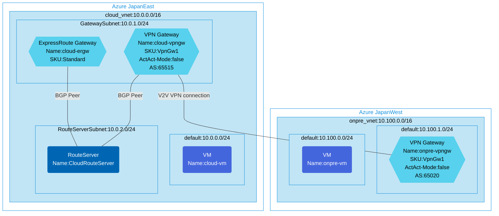

ExpressRoute gateway and VPN gateway transit configuration.

```mermaid
graph TB;
%% Groups and Services
subgraph GR2[Azure JapanWest]
  subgraph ONPV1[onpre_vnet:10.100.0.0/16]
     subgraph ONPS1[default:10.100.1.0/24]
      VPNGW2{{"VPN Gateway<br/>Name:onpre-vpngw<br/>SKU:VpnGw1<br/>ActAct-Mode:false<br/>AS:65020"}}
    end
      subgraph ONPS2[default:10.100.0.0/24]
        CP2("VM<br/>Name:onpre-vm")
    end
end
end
subgraph GR1[Azure JapanEast]
  subgraph GV1[cloud_vnet:10.0.0.0/16]
      subgraph GVS2[GatewaySubnet:10.0.1.0/24]
        VPNGW1{{"VPN Gateway<br/>Name:cloud-vpngw<br/>SKU:VpnGw1<br/>ActAct-Mode:false<br/>AS:65515"}}
        ERGW1{{"ExpressRoute Gateway<br/>Name:cloud-ergw<br/>SKU:Standard"}}
      end
      subgraph GVS1[default:10.0.0.0/24]
        CP1("VM<br/>Name:cloud-vm")
      end
      subgraph GVS5[RouteServerSubnet:10.0.2.0/24]
        RS1("RouteServer<br/>Name:CloudRouteServer")
      end
  end
end

%% Relation for resources
VPNGW1 --V2V VPN connection--- VPNGW2
VPNGW1 --BGP Peer--- RS1
ERGW1 --BGP Peer--- RS1

%% Groups style
classDef GSR fill:#fff,color:#1490df,stroke:#1490df
class GR1,GR2 GSR

classDef SGV1 fill:#c1e5f5,color:#000,stroke:#1490df
class GV1,GV2,GV3,GC2,GVS1,GVS2,GVS3,GVS4,GVS5 SGV1

classDef SGonpV fill:#c1e5f5,color:#000,stroke:#1490df
class ONPV1,ONPS1,ONPS2 SGonpV
 
%% Service Style
classDef SCP fill:#4466dd,color:#fff,stroke:none
class CP1,CP2,CP3,CP4 SCP

classDef SVPNGW fill:#57d1ed,color:#000,stroke:none
class VPNGW1,VPNGW2,ERGW1 SVPNGW

classDef SVPRS fill:#0066b4,color:#fff,stroke:none
class RS1 SVPRS

classDef SLNGW fill:#70b126,color:#fff,stroke:none
class LNGW1,LNGW2 SLNGW

```
