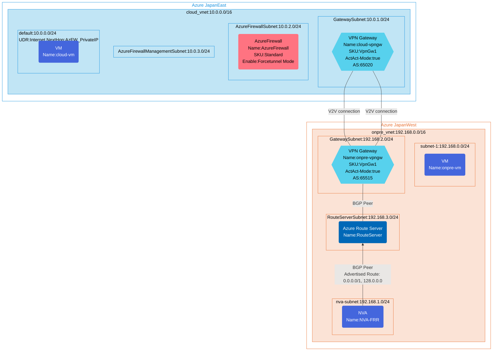

## Architecture
Force tunneling configuration using Azure Firewall in force tunnel mode with BGP route advertisement.



## Features of the template

- Deploys Azure Firewall in force tunnel mode with Standard SKU
- Creates two virtual networks in different Azure regions (JapanEast and JapanWest)
- Sets up VPN gateways and VNet-to-VNet connections with BGP routing
- Configures Azure Route Server for BGP route advertisement and learning
- Implements Network Virtual Appliance (NVA) with FRRouting for default route advertisements (0.0.0.0/1, 128.0.0.0/1)
- Sets up User Defined Routes (UDR) to direct traffic through Azure Firewall
- Provides both Ubuntu and Windows VMs for connectivity testing
- Supports diagnostic logging capabilities when enabled

## Usage

### Prerequisites
- Azure subscription
- Resource group created in supported regions (JapanEast and JapanWest)
- Contributor access to the resource group
- Azure CLI or PowerShell installed for deployment

### Deployment

1. Clone the repository containing the Bicep templates
2. Navigate to the force-tunneling-configuration-using-AzFW-forcetunnel-mode directory
3. Update the parameter.bicepparam file with your own values:
   - locationSite1: Azure region for the cloud site (default: japaneast)
   - locationSite2: Azure region for the on-premises simulation site (default: japanwest)
   - vmAdminUsername: Username for the VMs
   - vmAdminPassword: Password for the VMs
   - enablediagnostics: Set to true/false to enable/disable diagnostic logs

4. Deploy using Azure CLI:
   ```bash
   az login
   az group create --name <your-resource-group> --location <location>
   az deployment group create --resource-group <your-resource-group> --template-file main.bicep --parameters parameter.bicepparam
   ```

   Or deploy using PowerShell:
   ```powershell
   Connect-AzAccount
   New-AzResourceGroup -Name <your-resource-group> -Location <location>
   New-AzResourceGroupDeployment -ResourceGroupName <your-resource-group> -TemplateFile main.bicep -TemplateParameterFile parameter.bicepparam
   ```

5. Verify the deployment in the Azure Portal by checking:
   - The VPN gateway connections between the two virtual networks
   - Azure Firewall configuration in force tunnel mode
   - BGP configuration on Route Server and VPN gateways
   - Network Virtual Appliance (NVA) default route advertisement
   - User Defined Routes (UDR) routing traffic through Azure Firewall
