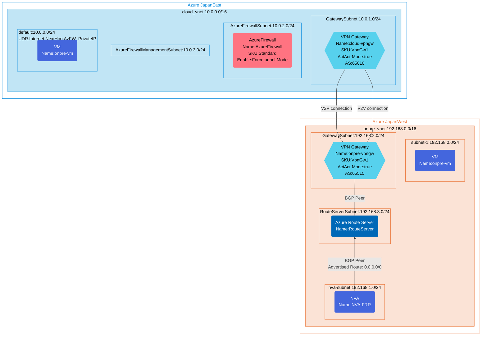

```mermaid
graph BT;
%% Groups and Services
subgraph GR2[Azure JapanEast]
  subgraph GV2[cloud_vnet:10.0.0.0/16]
     subgraph GVS6[GatewaySubnet:10.0.1.0/24]
      VPNGW2{{"VPN Gateway<br/>Name:cloud-vpngw<br/>SKU:VpnGw1<br/>ActAct-Mode:true<br/>AS:65010"}}
    end
     subgraph GVS8[AzureFirewallSubnet:10.0.2.0/24]
        AzFW("AzureFirewall<br/>Name:AzureFirewall<br/>SKU:Standard<br/>Enable:Forcetunnel Mode")
    end
      subgraph GVS9[AzureFirewallManagementSubnet:10.0.3.0/24]
        AzFW("AzureFirewall<br/>Name:AzureFirewall<br/>SKU:Standard<br/>Enable:Forcetunnel Mode")
    end
      subgraph GVS7[default:10.0.0.0/24<br/>UDR:Internet NextHop:AzFW_PrivateIP]
        CP3("VM<br/>Name:onpre-vm")
    end
end
end
subgraph GR1[Azure JapanWest]
  subgraph GV1[onpre_vnet:192.168.0.0/16]
      subgraph GVS1[subnet-1:192.168.0.0/24]
        CP1("VM<br/>Name:onpre-vm")
      end
      subgraph GVS2[nva-subnet:192.168.1.0/24]
        CP2("NVA<br/>Name:NVA-FRR")
      end
      subgraph GVS4[RouteServerSubnet:192.168.3.0/24]
        RS("Azure Route Server<br/>Name:RouteServer")
      end
      subgraph GVS3[GatewaySubnet:192.168.2.0/24]
        VPNGW1{{"VPN Gateway<br/>Name:onpre-vpngw<br/>SKU:VpnGw1<br/>ActAct-Mode:true<br/>AS:65515"}}
      end
end
end

%% Relation for resources
VPNGW1 --V2V connection--- VPNGW2
VPNGW1 --V2V connection--- VPNGW2
CP2 --BGP Peer<br/>Advertised Route: 0.0.0.0/0---> RS
RS --BGP Peer--- VPNGW1

%% Groups style
classDef GSR1 fill:#fff,color:#e97132,stroke:#e97132
class GR1 GSR1

classDef GSR2 fill:#fff,color:#1490df,stroke:#1490df
class GR2 GSR2

classDef SGV1 fill:#fbe3d6,color:#000,stroke:#e97132
class GV1,GVS1,GVS2,GVS3,GVS4,GVS5 SGV1

classDef SGV2 fill:#c1e5f5,color:#000,stroke:#1490df
class GV2,GVS6,GVS7,GVS8,GVS9 SGV2
 
%% Service Style
classDef SCP fill:#4466dd,color:#fff,stroke:none
class CP1,CP2,CP3 SCP

classDef SVPNGW fill:#57d1ed,color:#000,stroke:none
class VPNGW1,VPNGW2 SVPNGW

classDef SRS fill:#0068b7,color:#fff,stroke:none
class RS SRS

classDef SFW fill:#ff7381,color:#000,stroke:none
class AzFW SFW

classDef SLNGW fill:#70b126,color:#fff,stroke:none
class LNGW1,LNGW2 SLNGW

```
