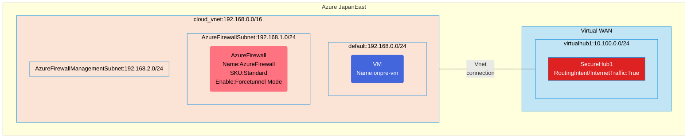

Azure Firewall forced tunneling configuration using Virtual WAN Routing Intent (Internet-Traffic).

```mermaid
graph TB;
%% Groups and Services
subgraph GR1[Azure JapanEast]
  subgraph GonpV[cloud_vnet:192.168.0.0/16]
    subgraph GonpS2[default:192.168.0.0/24]
    CP1("VM<br/>Name:onpre-vm")
  end
      subgraph GonpS3[AzureFirewallSubnet:192.168.1.0/24]
      AzFW("AzureFirewall<br/>Name:AzureFirewall<br/>SKU:Standard<br/>Enable:Forcetunnel Mode")
    end
      subgraph GonpS4[AzureFirewallManagementSubnet:192.168.2.0/24]
  end
end
end
subgraph GR1[Azure JapanEast]
  subgraph GV1[Virtual WAN]
    subgraph GV2[virtualhub1:10.100.0.0/24]
      subgraph SECHUB1[SecureHub1<br/>RoutingIntent/InternetTraffic:True]
end
end
end
end

%% Relation for resources
GonpV --Vnet<br/>connection---- GV2

%% Groups style
classDef GSR fill:#fff,color:#1490df,stroke:#1490df
class GR1,GR2 GSR

classDef SGV1 fill:#c1e5f5,color:#000,stroke:#1490df
class GV1,GV2 SGV1

classDef SGonpV fill:#fbe3d6,color:#000,stroke:#1490df
class GonpV,GonpS1,GonpS2,GonpS3,GonpS4 SGonpV

classDef SGSH fill:#de2222,color:#fff,stroke:#1490df
class SECHUB1 SGSH
 
%% Service Style
classDef SCP fill:#4466dd,color:#fff,stroke:none
class CP1 SCP

classDef SVPNGW fill:#57d1ed,color:#000,stroke:none
class VPNGW1,VPNGW2 SVPNGW

classDef SLNGW fill:#70b126,color:#fff,stroke:none
class LNGW1 SLNGW

classDef SFW fill:#ff7381,color:#000,stroke:none
class AzFW SFW

```
