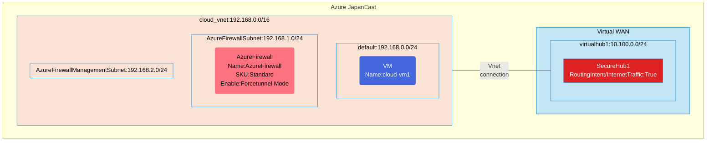

## Architecture

Azure Firewall forced tunneling configuration using Virtual WAN Routing Intent (Internet-Traffic).



## Features of the template

- Deploys Azure Firewall in force tunnel mode with a standard SKU
- Creates a Virtual WAN with a virtual hub
- Configures Routing Intent for Internet traffic through the secure hub
- Sets up a virtual network with appropriate subnets (default, AzureFirewallSubnet, AzureFirewallManagementSubnet)
- Creates a virtual network connection between the VNet and the virtual hub
- Deploys a VM in the default subnet for testing
- Configures firewall policy with network rules
- Optional diagnostic logging to Log Analytics

## Usage

### Prerequisites

- Azure subscription
- Resource group created in a supported region
- Contributor access to the resource group
- Azure CLI or PowerShell installed for deployment

### Deployment

1. Clone the repository containing the Bicep templates
2. Navigate to the force-tunneling-using-vwan-securehub-routing-intent directory
3. Update the parameter.json file with your own values:
   - locationSite1: Azure region for deployment (default: japaneast)
   - vmAdminUsername: Username for the VM
   - vmAdminPassword: Password for the VM
   - enablediagnostics: Set to true if you want to enable diagnostic logs

4. Deploy using Azure CLI:
   ```bash
   az login
   az group create --name <your-resource-group> --location <location>
   az deployment group create --resource-group <your-resource-group> --template-file main.bicep --parameters parameter.json
   ```

   Or deploy using PowerShell:
   ```powershell
   Connect-AzAccount
   New-AzResourceGroup -Name <your-resource-group> -Location <location>
   New-AzResourceGroupDeployment -ResourceGroupName <your-resource-group> -TemplateFile main.bicep -TemplateParameterFile parameter.json
   ```

5. Verify the deployment in the Azure Portal by checking:
   - The Azure Firewall configuration with force tunnel mode
   - Virtual WAN and virtual hub with routing intent enabled
   - Virtual network connection between the VNet and virtual hub
   - The VM deployment and network connectivity
