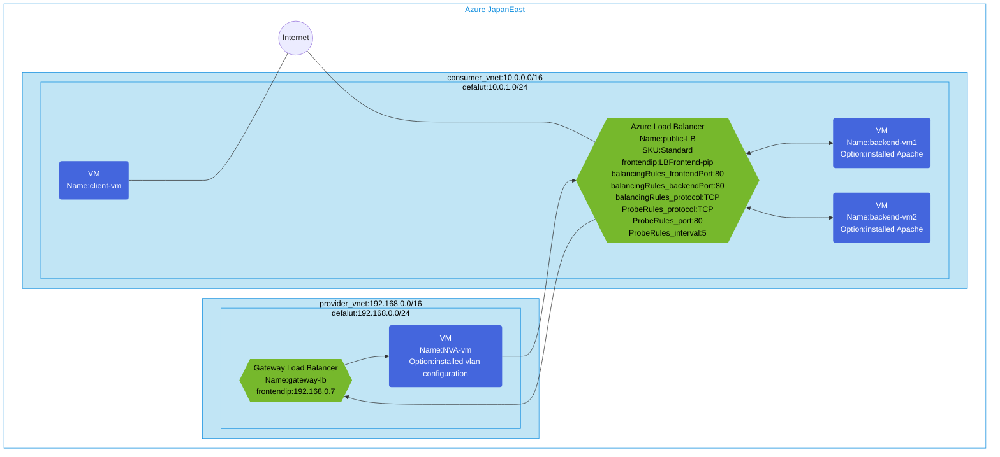

## Architecture
Configuring network traffic inspection using Azure Gateway Load Balancer with Ubuntu NVA (Network Virtual Appliance).



## Features of the template

- Deploys a Standard SKU public Azure Load Balancer with public frontend IP
- Creates a Gateway Load Balancer in a provider VNet for traffic inspection
- Configures an Ubuntu NVA (Network Virtual Appliance) with VXLAN tunneling
- Sets up 2 backend virtual machines with Apache web server installed
- Creates a client VM for testing the environment
- Establishes traffic flow through the Gateway Load Balancer for inspection
- Configures TCP load balancing rules for port 80
- Sets up health probe to monitor backend server availability

## Usage

### Prerequisites
- Azure subscription
- Resource group created in a supported region
- Contributor access to the resource group
- Azure CLI or PowerShell installed for deployment

### Deployment

1. Clone the repository containing the Bicep templates
2. Navigate to the gateway-lb-ubuntu-nva directory
3. Update the parameter.json file with your own values:
   - locationSite1: Azure region for deployment (default: japaneast)
   - vmAdminUsername: Username for the VMs
   - vmAdminPassword: Password for the VMs

4. Deploy using Azure CLI:
   ```bash
   az login
   az group create --name <your-resource-group> --location <location>
   az deployment group create --resource-group <your-resource-group> --template-file main.bicep --parameters parameter.json
   ```

   Or deploy using PowerShell:
   ```powershell
   Connect-AzAccount
   New-AzResourceGroup -Name <your-resource-group> -Location <location>
   New-AzResourceGroupDeployment -ResourceGroupName <your-resource-group> -TemplateFile main.bicep -TemplateParameterFile parameter.json
   ```

5. Verify the deployment in the Azure Portal by checking:
   - The public Load Balancer configuration
   - The Gateway Load Balancer configuration
   - The NVA VM with VXLAN configuration
   - Backend pool with the two Apache VMs
   - Health probe settings
   - Load balancing rules
