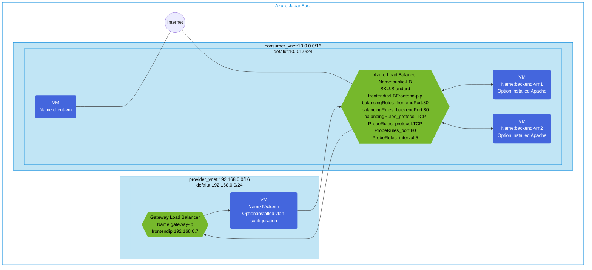

Configuration using Gateway Load Balancer

```mermaid
graph TB;
%% Groups and Services
subgraph GR1[Azure JapanEast]
    IT((Internet))
  subgraph GV1[consumer_vnet:10.0.0.0/16]
      subgraph GVS2[defalut:10.0.1.0/24]
        CP1("VM<br/>Name:client-vm")
        ALB{{"Azure Load Balancer<br/>Name:public-LB<br/>SKU:Standard<br/>frontendip:LBFrontend-pip<br/>balancingRules_frontendPort:80<br/>balancingRules_backendPort:80<br/>balancingRules_protocol:TCP<br/>ProbeRules_protocol:TCP<br/>ProbeRules_port:80<br/>ProbeRules_interval:5"}}
        CP2("VM<br/>Name:backend-vm1<br/>Option:installed Apache")
        CP3("VM<br/>Name:backend-vm2<br/>Option:installed Apache")
      end
end
  subgraph GV2[provider_vnet:192.168.0.0/16]
   subgraph GVS3[defalut:192.168.0.0/24]
        GWLB{{"Gateway Load Balancer<br/>Name:gateway-lb<br/>frontendip:192.168.0.7"}}
        CP4("VM<br/>Name:NVA-vm<br/>Option:installed vlan configuration") 
end
end
end

%% Relation for resources
CP1 <--- IT <--- ALB
ALB --> GWLB --> CP4 --> ALB
ALB <---> CP2
ALB <---> CP3

%% Groups style
classDef GSR fill:#fff,color:#1490df,stroke:#1490df
class GR1,GR2 GSR

classDef SGV1 fill:#c1e5f5,color:#000,stroke:#1490df
class GV1,GVS1,GVS2,GVS3,GVS4 SGV1

classDef SGV2 fill:#c1e5f5,color:#000,stroke:#1490df
class GV2 SGV2
 
%% Service Style
classDef SCP fill:#4466dd,color:#fff,stroke:none
class CP1,CP2,CP3,CP4 SCP

classDef SVPALB fill:#76b82c,color:#000,stroke:none
class ALB SVPALB

classDef SVPGWLB fill:#76b82c,color:#000,stroke:none
class GWLB SVPGWLB

classDef SLNGW fill:#70b126,color:#fff,stroke:none
class LNGW1,LNGW2 SLNGW

```
