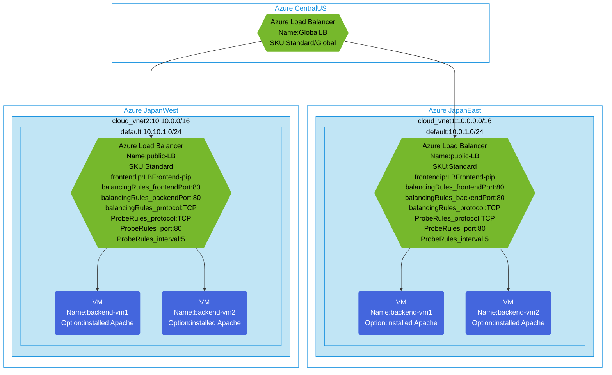

## Architecture
Configuring access to VMs with Apache installed via Global Load Balancer across multiple regions.



## Features of the template

- Deploys a Standard SKU Global Load Balancer in Central US region
- Creates Standard SKU regional load balancers in Japan East and Japan West
- Configures backend virtual machines with Apache web server installed in each region
- Implements cross-region load balancing using the global load balancer
- Configures TCP load balancing rules for port 80
- Sets up health probes to monitor backend server availability
- Creates separate virtual networks for each region
- Provides high availability through regional distribution of resources

## Usage

### Prerequisites
- Azure subscription
- Resource group created in supported regions (Central US, Japan East, Japan West)
- Contributor access to the resource group
- Azure CLI or PowerShell installed for deployment

### Deployment

1. Clone the repository containing the Bicep templates
2. Navigate to the global-lb-apache directory
3. Update the parameter.json file with your own values:
   - locationCentralUS: Central US region for global load balancer deployment
   - locationEast: Japan East region for regional deployment
   - locationWest: Japan West region for regional deployment
   - vmAdminUsername: Username for the VMs
   - vmAdminPassword: Password for the VMs

4. Deploy using Azure CLI:
   ```bash
   az login
   az group create --name <your-resource-group> --location centralus
   az deployment group create --resource-group <your-resource-group> --template-file main.bicep --parameters parameter.json
   ```

   Or deploy using PowerShell:
   ```powershell
   Connect-AzAccount
   New-AzResourceGroup -Name <your-resource-group> -Location centralus
   New-AzResourceGroupDeployment -ResourceGroupName <your-resource-group> -TemplateFile main.bicep -TemplateParameterFile parameter.json
   ```

5. Verify the deployment in the Azure Portal by checking:
   - The global load balancer in Central US
   - Regional load balancers in Japan East and Japan West
   - Backend pool configurations
   - Health probe settings
   - Load balancing rules
   - Apache VMs in both regions
