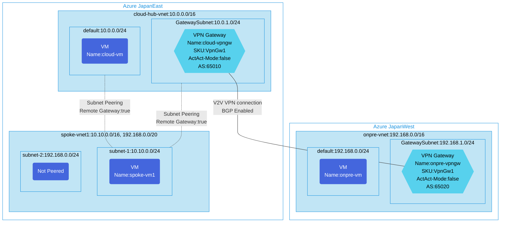

## Architecture
Hub and Spoke configuration with subnet-level peering and VPN Gateway. This architecture provides a central hub virtual network that connects to on-premises networks via VPN Gateway, with a spoke virtual network using selective subnet peering to the hub.



## Features of the template

- Implements a Hub and Spoke network topology with **subnet-level peering** instead of full VNet peering
- Creates a hub virtual network with a VPN Gateway for connecting to on-premises networks
- Deploys a spoke virtual network with multiple subnets
- Configures selective subnet peering between hub and spoke (only specific subnets are peered)
- Enables remote gateway usage from spoke to hub with subnet-level granularity
- Connects two Azure regions (JapanEast and JapanWest) via site-to-site VPN
- Deploys Ubuntu 20.04 virtual machines in hub, spoke, and on-premises networks for connectivity testing
- Applies network security groups to protect the virtual networks
- Configures BGP routing between VPN gateways with different ASNs (65010 and 65020)
- Optionally enables diagnostic logs with a Log Analytics workspace
- Demonstrates advanced peering scenarios where not all subnets need connectivity

## Key Differences from Standard Hub-Spoke
- Uses `peerCompleteVnets: false` with `localSubnetNames` and `remoteSubnetNames` properties
- Provides granular control over which subnets can communicate across peering
- Useful for security isolation scenarios where only specific workloads should communicate

## Usage

### Prerequisites
- Azure subscription
- Resource group created in supported regions
- Contributor access to the resource group
- Azure CLI or PowerShell installed for deployment

### Deployment

1. Clone the repository containing the Bicep templates
2. Navigate to the hub-spoke-subnetpeering-env directory
3. Update the parameter.bicepparam file with your own values:
   - locationSite1: Azure region for hub and spoke (default: japaneast)
   - locationSite2: Azure region for simulated on-premises (default: japanwest)
   - vmAdminUsername: Username for the VMs
   - vmAdminPassword: Password for the VMs (must be secure)
   - enablediagnostics: Enable diagnostic logs (default: false)

4. Deploy using Azure CLI:
   ```bash
   az login
   az group create --name <your-resource-group> --location japaneast
   az deployment group create --resource-group <your-resource-group> --template-file main.bicep --parameters parameter.bicepparam
   ```

   Or deploy using PowerShell:
   ```powershell
   Connect-AzAccount
   New-AzResourceGroup -Name <your-resource-group> -Location japaneast
   New-AzResourceGroupDeployment -ResourceGroupName <your-resource-group> -TemplateFile main.bicep -TemplateParameterFile parameter.bicepparam
   ```

5. Verify the deployment in the Azure Portal by checking:
   - The hub virtual network with VPN Gateway in JapanEast
   - The spoke virtual network with multiple subnets
   - The subnet-level peering configurations (check peering properties for subnet names)
   - The simulated on-premises network with VPN Gateway in JapanWest
   - VPN connection between the two regions
   - The virtual machines in each network

## Network Details

### Hub Network (cloud-hub-vnet)
- Address Space: 10.0.0.0/16
- Subnets:
  - default: 10.0.0.0/24 (peered with spoke subnet-1)
  - GatewaySubnet: 10.0.1.0/24 (peered with spoke subnet-1)

### Spoke Network (spoke-vnet1)
- Address Space: 10.10.0.0/16, 192.168.0.0/20
- Subnets:
  - subnet-1: 10.10.0.0/24 (peered with hub)
  - subnet-2: 192.168.0.0/24 (NOT peered, isolated)

### On-Premises Network (onpre-vnet)
- Address Space: 192.168.0.0/16
- Subnets:
  - default: 192.168.0.0/24
  - GatewaySubnet: 192.168.1.0/24
