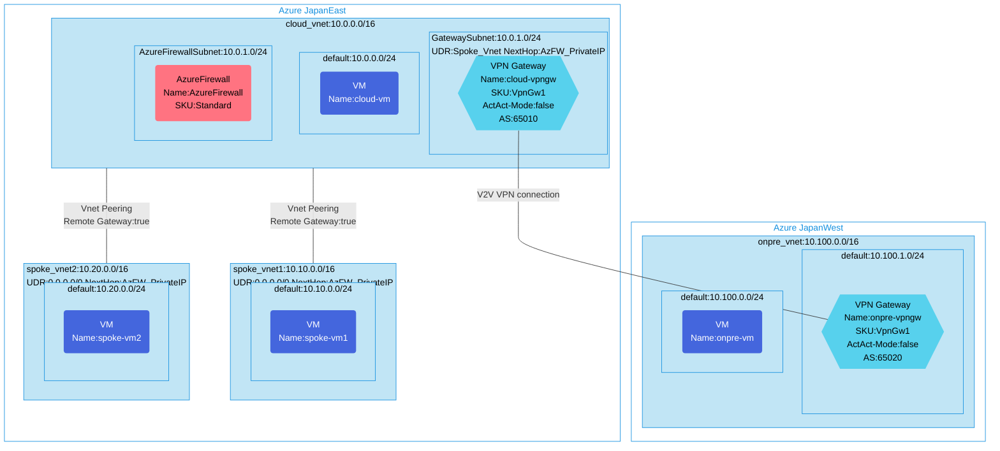

## Architecture
Hub and Spoke configuration with VPN Gateway via Azure Firewall. This architecture provides secure connectivity between on-premises networks, hub VNet, and multiple spoke VNets with centralized traffic inspection through Azure Firewall.



## Features of the template

- Deploys a hub virtual network (10.0.0.0/16) with Azure Firewall and VPN Gateway
- Creates two spoke virtual networks (10.10.0.0/16 and 10.20.0.0/16) connected to the hub via VNet peering
- Configures a simulated on-premises environment in a separate Azure region with VPN Gateway
- Sets up site-to-site VPN connection between on-premises and Azure hub VNet
- Implements centralized traffic inspection using Azure Firewall
- Configures User Defined Routes (UDR) to route traffic from spoke VNets through Azure Firewall
- Enables transitive routing for spoke-to-on-premises communication via the hub
- Deploys test VMs in each network segment for connectivity validation

## Usage

### Prerequisites
- Azure subscription
- Resource groups created in supported regions (JapanEast and JapanWest)
- Contributor access to the resource groups
- Azure CLI or PowerShell installed for deployment

### Deployment

1. Clone the repository containing the Bicep templates
2. Navigate to the hubFW-spoke-env directory
3. Update the parameter.json file with your own values:
   - locationSite1: Azure region for hub and spoke resources (default: japaneast)
   - locationSite2: Azure region for on-premises simulation (default: japanwest)
   - vmAdminUsername: Username for the VMs
   - vmAdminPassword: Password for the VMs

4. Deploy using Azure CLI:
   ```bash
   az login
   az group create --name <your-resource-group-site1> --location <location-site1>
   az group create --name <your-resource-group-site2> --location <location-site2>
   az deployment group create --resource-group <your-resource-group-site1> --template-file main.bicep --parameters parameter.json
   ```

   Or deploy using PowerShell:
   ```powershell
   Connect-AzAccount
   New-AzResourceGroup -Name <your-resource-group-site1> -Location <location-site1>
   New-AzResourceGroup -Name <your-resource-group-site2> -Location <location-site2>
   New-AzResourceGroupDeployment -ResourceGroupName <your-resource-group-site1> -TemplateFile main.bicep -TemplateParameterFile parameter.json
   ```

5. Verify the deployment in the Azure Portal by checking:
   - VNet peering configurations between hub and spoke networks
   - Azure Firewall deployment and rules
   - VPN Gateway connections between regions
   - Route tables and UDRs directing traffic through Azure Firewall
   - Connectivity between VMs in different network segments
