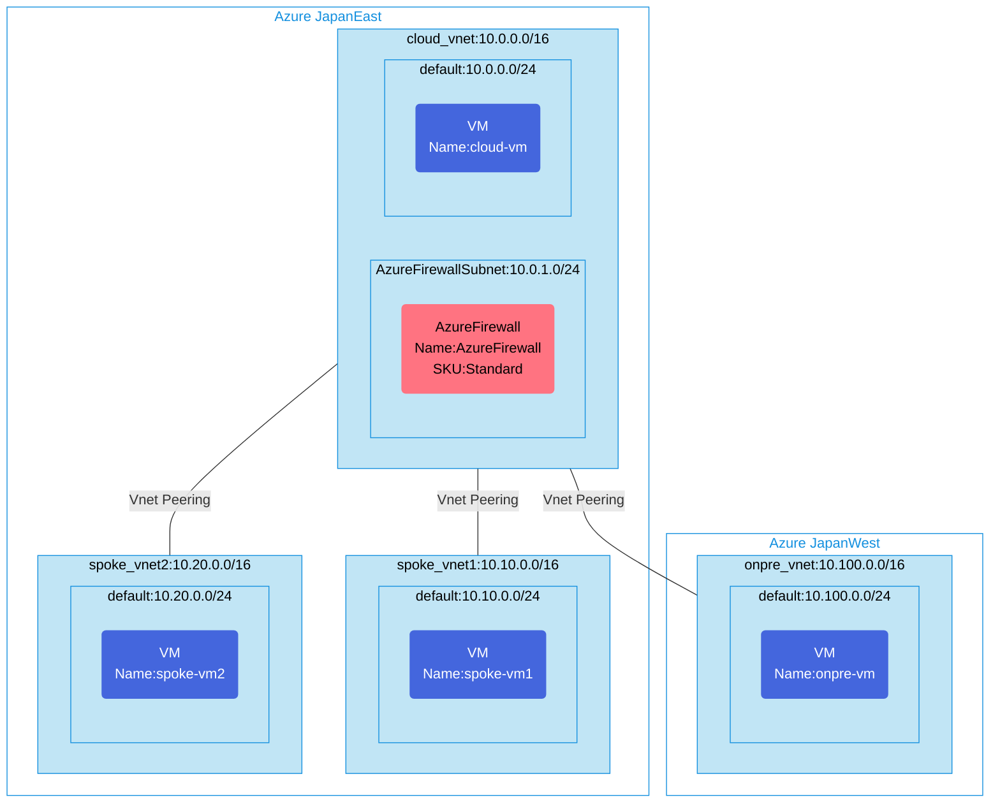

Hub and Spoke vnet peering configuration via Azure Firewall.

```mermaid
graph TB;
%% Groups and Services
subgraph GR1[Azure JapanEast]
  subgraph GV1[cloud_vnet:10.0.0.0/16]
      subgraph GVS5[AzureFirewallSubnet:10.0.1.0/24]
        AzFW("AzureFirewall<br/>Name:AzureFirewall<br/>SKU:Standard")
      end
      subgraph GVS1[default:10.0.0.0/24]
        CP1("VM<br/>Name:cloud-vm")
      end
  end
  subgraph GV2[spoke_vnet1:10.10.0.0/16]
      subgraph GVS3[default:10.10.0.0/24]
        CP3("VM<br/>Name:spoke-vm1")
      end
end
  subgraph GV3[spoke_vnet2:10.20.0.0/16]
      subgraph GVS4[default:10.20.0.0/24]
        CP4("VM<br/>Name:spoke-vm2")
      end
end
end
subgraph GR2[Azure JapanWest]
  subgraph ONPV1[onpre_vnet:10.100.0.0/16]
      subgraph ONPS2[default:10.100.0.0/24]
        CP2("VM<br/>Name:onpre-vm")
    end
end
end

%% Relation for resources
GV1 --Vnet Peering---ONPV1
GV1 --Vnet Peering---GV2
GV1 --Vnet Peering---GV3

%% Groups style
classDef GSR fill:#fff,color:#1490df,stroke:#1490df
class GR1,GR2 GSR

classDef SGV1 fill:#c1e5f5,color:#000,stroke:#1490df
class GV1,GV2,GV3,GC2,GVS1,GVS2,GVS3,GVS4,GVS5 SGV1

classDef SGonpV fill:#c1e5f5,color:#000,stroke:#1490df
class ONPV1,ONPS1,ONPS2 SGonpV
 
%% Service Style
classDef SCP fill:#4466dd,color:#fff,stroke:none
class CP1,CP2,CP3,CP4,CP5 SCP

classDef SFW fill:#ff7381,color:#000,stroke:none
class AzFW SFW

classDef SVPNGW fill:#57d1ed,color:#000,stroke:none
class VPNGW1,VPNGW2 SVPNGW

```
