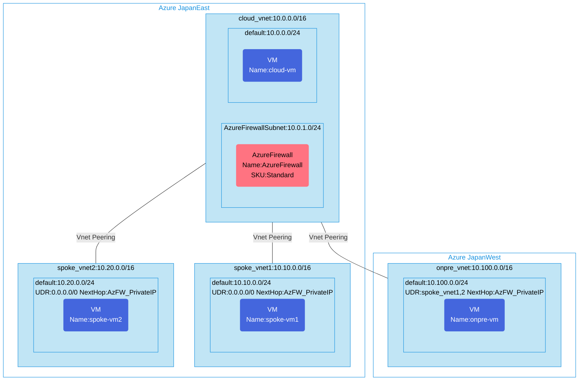

## Architecture
Hub and Spoke vnet peering configuration via Azure Firewall.



## Features of the template

- Implements a Hub and Spoke network topology with Azure Firewall in the hub network
- Deploys resources across two Azure regions (Japan East and Japan West)
- Creates a hub virtual network (cloud_vnet) with Azure Firewall in Japan East
- Deploys two spoke virtual networks in Japan East with VNet peering to the hub
- Configures a simulated on-premises network (onpre_vnet) in Japan West with VNet peering to the hub
- Sets up user-defined routes (UDRs) to direct traffic through the Azure Firewall
- Configures Azure Firewall with a policy allowing all traffic
- Deploys Ubuntu 20.04 virtual machines in each network for connectivity testing
- Applies network security groups to protect the virtual networks
- Optionally enables diagnostic logs with a Log Analytics workspace

## Usage

### Prerequisites
- Azure subscription
- Resource group created in supported regions (Japan East and Japan West)
- Contributor access to the resource group
- Azure CLI or PowerShell installed for deployment

### Deployment

1. Clone the repository containing the Bicep templates
2. Navigate to the hubFW-spoke-vnetpeering-env directory
3. Update the parameter.json file with your own values:
   - locationSite1: Azure region for hub and spoke networks (default: japaneast)
   - locationSite2: Azure region for on-premises simulation (default: japanwest)
   - vmAdminUsername: Username for the VMs
   - vmAdminPassword: Password for the VMs
   - enablediagnostics: Enable diagnostic logs (true/false)

4. Deploy using Azure CLI:
   ```bash
   az login
   az group create --name <your-resource-group> --location japaneast
   az deployment group create --resource-group <your-resource-group> --template-file main.bicep --parameters parameter.json
   ```

   Or deploy using PowerShell:
   ```powershell
   Connect-AzAccount
   New-AzResourceGroup -Name <your-resource-group> -Location japaneast
   New-AzResourceGroupDeployment -ResourceGroupName <your-resource-group> -TemplateFile main.bicep -TemplateParameterFile parameter.json
   ```

5. Verify the deployment in the Azure Portal by checking:
   - The hub virtual network with Azure Firewall
   - The two spoke virtual networks
   - VNet peering configurations between hub and spoke networks
   - The on-premises simulation network
   - The virtual machines in each network
