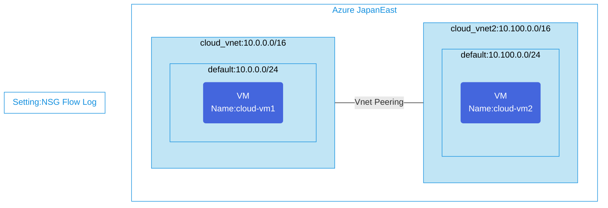

Vnet Peering configuration using NSG Flowlog.

```mermaid
graph TB;
%% Groups and Services
subgraph GR1[Azure JapanEast]
  subgraph GV1[cloud_vnet:10.0.0.0/16]
      subgraph GVS1[default:10.0.0.0/24]
        CP1("VM<br/>Name:cloud-vm1")
      end
end
  subgraph GV2[cloud_vnet2:10.100.0.0/16]
      subgraph GVS3[default:10.100.0.0/24]
        CP2("VM<br/>Name:cloud-vm2")
      end
end
end

subgraph GR3[Setting:NSG Flow Log]
end

%% Relation for resources
GV1 --Vnet Peering--- GV2

%% Groups style
classDef GSR fill:#fff,color:#1490df,stroke:#1490df
class GR1,GR2,GR3 GSR

classDef SGV1 fill:#c1e5f5,color:#000,stroke:#1490df
class GV1,GV2,GV3,GVS1,GVS2,GVS3,GVS4 SGV1
 
%% Service Style
classDef SCP fill:#4466dd,color:#fff,stroke:none
class CP1,CP2,CP3 SCP

classDef SVPNGW fill:#57d1ed,color:#000,stroke:none
class ERGW1 SVPNGW

```
