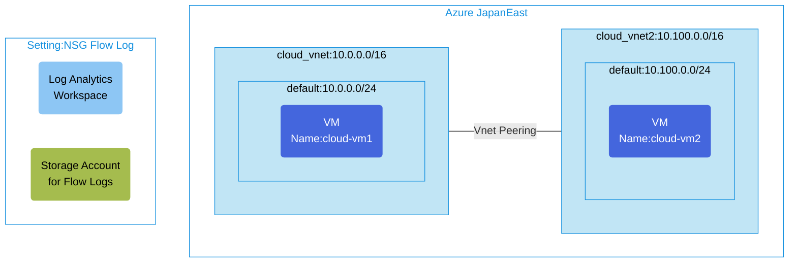

## Architecture
VNet Peering configuration with NSG Flow Log for network traffic monitoring.



## Features of the template

- Deploys two virtual networks with VNet peering between them
- Configures NSG Flow Logs for monitoring network traffic
- Creates a storage account to store the flow logs data
- Sets up Log Analytics workspace for traffic analytics
- Deploys virtual machines in both networks for connectivity testing
- Applies network security groups to protect virtual networks
- Enables traffic analytics with a 10-minute analytics interval
- Uses Flow Logs version 2 for enhanced logging capabilities

## Usage

### Prerequisites
- Azure subscription
- Resource group created in a supported region
- NetworkWatcherRG resource group available in your subscription (created automatically when Network Watcher is enabled in your region)
- Contributor access to the resource group
- Azure CLI or PowerShell installed for deployment

### Deployment

1. Clone the repository containing the Bicep templates
2. Navigate to the nsg-flowlog-v2v-env directory
3. Update the parameter.json file with your own values:
   - locationSite1: Azure region for deployment (default: japaneast)
   - vmAdminUsername: Username for the VMs
   - vmAdminPassword: Password for the VMs

4. Deploy using Azure CLI:
   ```bash
   az login
   az group create --name <your-resource-group> --location <location>
   az deployment group create --resource-group <your-resource-group> --template-file main.bicep --parameters parameter.json
   ```

   Or deploy using PowerShell:
   ```powershell
   Connect-AzAccount
   New-AzResourceGroup -Name <your-resource-group> -Location <location>
   New-AzResourceGroupDeployment -ResourceGroupName <your-resource-group> -TemplateFile main.bicep -TemplateParameterFile parameter.json
   ```

5. Verify the deployment in the Azure Portal by checking:
   - The virtual networks and their peering configuration
   - The NSG Flow Logs settings in Network Watcher
   - The storage account used for flow logs
   - Log Analytics workspace with traffic analytics
   - The virtual machines in each network
