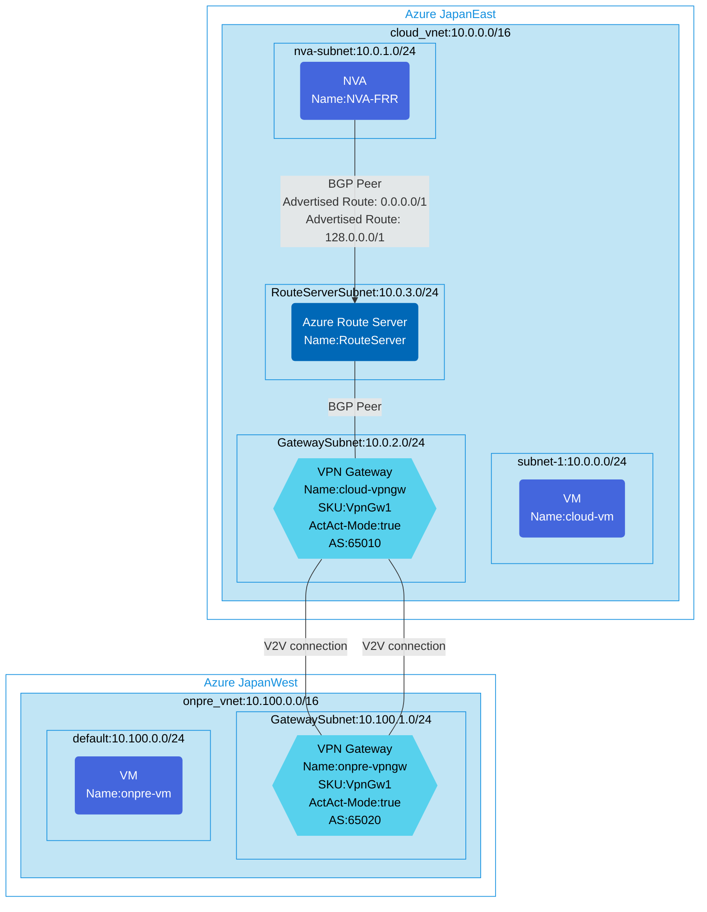

Configuring the NVA to advertise the default route to the RouteServer.

```mermaid
graph TB;
%% Groups and Services
subgraph GR2[Azure JapanWest]
  subgraph GV2[onpre_vnet:10.100.0.0/16]
     subgraph GVS6[GatewaySubnet:10.100.1.0/24]
      VPNGW2{{"VPN Gateway<br/>Name:onpre-vpngw<br/>SKU:VpnGw1<br/>ActAct-Mode:true<br/>AS:65020"}}
    end
      subgraph GVS7[default:10.100.0.0/24]
        CP3("VM<br/>Name:onpre-vm")
    end
end
end
subgraph GR1[Azure JapanEast]
  subgraph GV1[cloud_vnet:10.0.0.0/16]
      subgraph GVS1[subnet-1:10.0.0.0/24]
        CP1("VM<br/>Name:cloud-vm")
      end
      subgraph GVS2[nva-subnet:10.0.1.0/24]
        CP2("NVA<br/>Name:NVA-FRR")
      end
      subgraph GVS4[RouteServerSubnet:10.0.3.0/24]
        RS("Azure Route Server<br/>Name:RouteServer")
      end
      subgraph GVS3[GatewaySubnet:10.0.2.0/24]
        VPNGW1{{"VPN Gateway<br/>Name:cloud-vpngw<br/>SKU:VpnGw1<br/>ActAct-Mode:true<br/>AS:65010"}}
      end
end
end

%% Relation for resources
VPNGW1 --V2V connection--- VPNGW2
VPNGW1 --V2V connection--- VPNGW2
CP2 --BGP Peer<br/>Advertised Route: 0.0.0.0/1<br/>Advertised Route: 128.0.0.0/1---> RS
RS --BGP Peer--- VPNGW1

%% Groups style
classDef GSR fill:#fff,color:#1490df,stroke:#1490df
class GR1,GR2 GSR

classDef SGV1 fill:#c1e5f5,color:#000,stroke:#1490df
class GV1,GVS1,GVS2,GVS3,GVS4,GVS5,GVS6,GVS7 SGV1

classDef SGV2 fill:#c1e5f5,color:#000,stroke:#1490df
class GV2 SGV2
 
%% Service Style
classDef SCP fill:#4466dd,color:#fff,stroke:none
class CP1,CP2,CP3 SCP

classDef SVPNGW fill:#57d1ed,color:#000,stroke:none
class VPNGW1,VPNGW2 SVPNGW

classDef SRS fill:#0068b7,color:#fff,stroke:none
class RS SRS

classDef SLNGW fill:#70b126,color:#fff,stroke:none
class LNGW1,LNGW2 SLNGW

```
