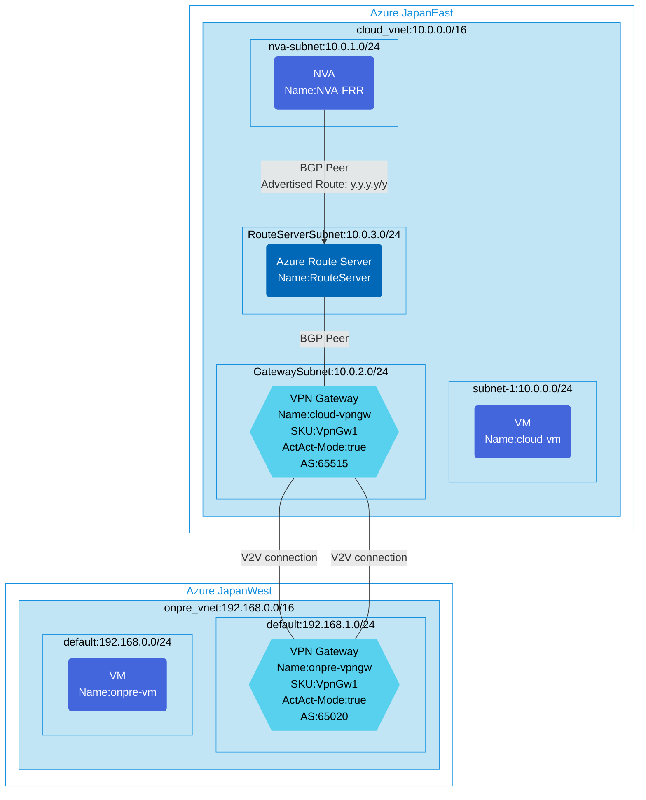

## Architecture
Configuring the NVA to advertise any route to the Azure Route Server.

By executing the provided python script on the "NVA-FRR" VM, you can advertise dummy routes of any number to Route Server/VPN Gateway.



## Features of the template

- Deploys a Network Virtual Appliance (NVA) with FRRouting (FRR) configured
- Sets up an Azure Route Server for BGP peering with the NVA
- Provides a Python script for advertising custom routes from NVA to Route Server
- Creates VPN gateways in Active-Active configuration for site-to-site connectivity
- Establishes VNet-to-VNet connections between cloud and on-premises environments
- Deploys sample VMs in both environments for connectivity testing
- Enables IP forwarding on the NVA for traffic routing

## Usage

### Prerequisites
- Azure subscription
- Resource group created in supported regions (japaneast and japanwest)
- Contributor access to the resource group
- Azure CLI or PowerShell installed for deployment

### Deployment

1. Clone the repository containing the Bicep templates
2. Navigate to the nva-advertised-route-toRS directory
3. Update the parameter.json file with your own values:
   - locationSite1: Azure region for cloud environment (default: japaneast)
   - locationSite2: Azure region for on-premise environment (default: japanwest)
   - vmAdminUsername: Username for the VMs
   - vmAdminPassword: Password for the VMs
   - enablediagnostics: Whether to enable diagnostic logs (default: false)

4. Deploy using Azure CLI:
   ```bash
   az login
   az group create --name <your-resource-group> --location japaneast
   az deployment group create --resource-group <your-resource-group> --template-file main.bicep --parameters parameter.json
   ```

   Or deploy using PowerShell:
   ```powershell
   Connect-AzAccount
   New-AzResourceGroup -Name <your-resource-group> -Location japaneast
   New-AzResourceGroupDeployment -ResourceGroupName <your-resource-group> -TemplateFile main.bicep -TemplateParameterFile parameter.json
   ```

5. Verify the deployment in the Azure Portal by checking:
   - The NVA configuration with FRRouting
   - Route Server BGP peering with the NVA
   - VPN gateway connections between cloud and on-premises environments

### Route Advertisement

After deployment, you can advertise custom routes from the NVA to the Route Server by executing the following script on the "NVA-FRR" VM:

```bash
wget https://raw.githubusercontent.com/toizumi03/bicep-templates/main/nva-advertised-route-toRS/bgp-route-advertised-test.py
sudo python3 bgp-route-advertised-test.py
```

The script will prompt you to enter the number of routes you want to advertise. After execution, the specified number of dummy routes will be created and advertised to the Route Server.
