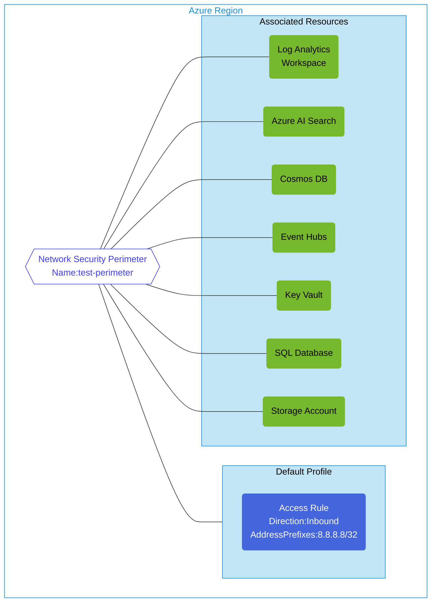

## Architecture
Configuration of Azure Network Security Perimeter with associated resources.



## Features of the template

- Deploys an Azure Network Security Perimeter with associated resources
- Creates a default profile with inbound access rules
- Optionally associates the following Azure resources with the perimeter:
  - Log Analytics Workspace
  - Azure AI Search
  - Cosmos DB
  - Event Hubs
  - Key Vault
  - SQL Database
  - Storage Account
- All resources are set to "Learning" access mode for traffic monitoring and analysis
- Parameter-driven deployment allows selecting which resources to create and associate

## Usage

### Prerequisites
- Azure subscription
- Resource group created in a supported region
- Contributor access to the resource group
- Azure CLI or PowerShell installed for deployment

### Deployment

1. Clone the repository containing the Bicep templates
2. Navigate to the perimeter-configuration directory
3. Update the params.bicepparam file with your own values:
   - locationSite1: Azure region for deployment (default: eastus)
   - vmAdminUsername: Username for the SQL Server
   - vmAdminPassword: Password for the SQL Server
   - createLoganalytics: Set to true/false to create and associate Log Analytics
   - createAisearch: Set to true/false to create and associate Azure AI Search
   - createCosmosdb: Set to true/false to create and associate Cosmos DB
   - createEventhubs: Set to true/false to create and associate Event Hubs
   - createKeyvault: Set to true/false to create and associate Key Vault
   - createSqldb: Set to true/false to create and associate SQL Database
   - createStoragaccount: Set to true/false to create and associate Storage Account

4. Deploy using Azure CLI:
   ```bash
   az login
   az group create --name <your-resource-group> --location <location>
   az deployment group create --resource-group <your-resource-group> --template-file main.bicep --parameters params.bicepparam
   ```

   Or deploy using PowerShell:
   ```powershell
   Connect-AzAccount
   New-AzResourceGroup -Name <your-resource-group> -Location <location>
   New-AzResourceGroupDeployment -ResourceGroupName <your-resource-group> -TemplateFile main.bicep -TemplateParameterFile params.bicepparam
   ```

5. Verify the deployment in the Azure Portal by checking:
   - The Network Security Perimeter configuration
   - Associated resources and their access settings
   - Default profile and access rules