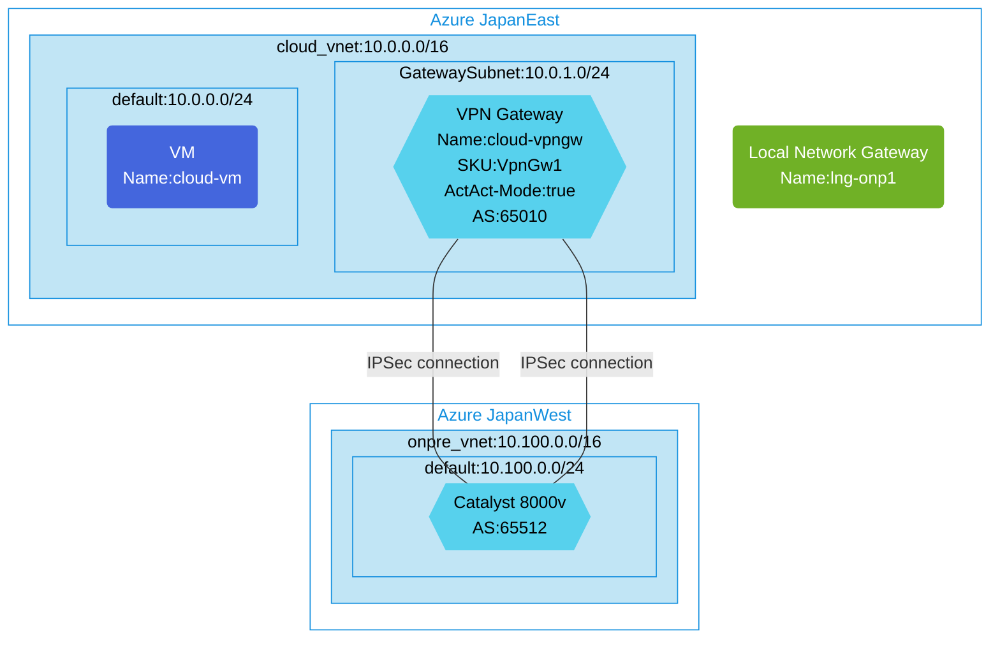

Configuring the Catalyst 8000v and VPN Gateway for a VPN Connection with APIPA BGP
Set the config setting manually.

```mermaid
graph TB;
%% Groups and Services
subgraph GR2[Azure JapanWest]
  subgraph GV2[onpre_vnet:10.100.0.0/16]
     subgraph GVS4[default:10.100.0.0/24]
      CAT8000{{"Catalyst 8000v<br/>AS:65512"}}
    end
end
end
subgraph GR1[Azure JapanEast]
  subgraph GV1[cloud_vnet:10.0.0.0/16]
      subgraph GVS2[GatewaySubnet:10.0.1.0/24]
        VPNGW1{{"VPN Gateway<br/>Name:cloud-vpngw<br/>SKU:VpnGw1<br/>ActAct-Mode:true<br/>AS:65010"}}
      end
      subgraph GVS1[default:10.0.0.0/24]
        CP1("VM<br/>Name:cloud-vm")
      end
end
    LNGW1("Local Network Gateway<br/>Name:lng-onp1")
end

%% Relation for resources
VPNGW1 --IPSec connection--- CAT8000
VPNGW1 --IPSec connection--- CAT8000

%% Groups style
classDef GSR fill:#fff,color:#1490df,stroke:#1490df
class GR1,GR2 GSR

classDef SGV1 fill:#c1e5f5,color:#000,stroke:#1490df
class GV1,GVS1,GVS2,GVS4 SGV1

classDef SGV2 fill:#c1e5f5,color:#000,stroke:#1490df
class GV2 SGV2
 
%% Service Style
classDef SCP fill:#4466dd,color:#fff,stroke:none
class CP1,CP2 SCP

classDef SVPNGW fill:#57d1ed,color:#000,stroke:none
class VPNGW1,CAT8000 SVPNGW

classDef SLNGW fill:#70b126,color:#fff,stroke:none
class LNGW1 SLNGW

```
