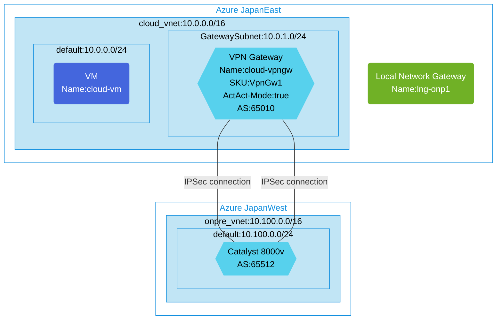

## Architecture
Configuring a Site-to-Site VPN connection between an Azure VPN Gateway and a Cisco Catalyst 8000v using APIPA BGP.



## Features of the template

- Deploys a Site-to-Site VPN connection between an Azure VPN Gateway and a Cisco Catalyst 8000v
- Configures an Active-Active VPN Gateway (cloud-vpngw) in Azure JapanEast with BGP enabled (AS: 65010)
- Sets up a Cisco Catalyst 8000v in Azure JapanWest to simulate an on-premises environment
- Utilizes APIPA (Automatic Private IP Addressing) for BGP peering with custom IP addresses (169.254.21.x)
- Creates Local Network Gateway to represent the on-premises network
- Establishes IPsec connection with BGP routing between the networks
- Deploys virtual networks in two Azure regions (10.0.0.0/16 and 10.100.0.0/16)
- Includes a client VM in the cloud virtual network for testing connectivity
- Configures custom IPsec policies for the VPN connection
- Note: Requires manual configuration of the Catalyst 8000v device

## Usage

### Prerequisites
- Azure subscription
- Resource group created in supported regions (JapanEast and JapanWest)
- Contributor access to the resource group
- Azure CLI or PowerShell installed for deployment
- Knowledge of configuring Cisco Catalyst 8000v routers

### Deployment

1. Clone the repository containing the Bicep templates
2. Navigate to the s2s-act-act-vpn-bgp-using-lngw-connction-with-cat8000v directory
3. Update the parameter.json file with your own values:
   - locationSite1: Azure region for cloud network (default: japaneast)
   - locationSite2: Azure region for on-premises simulation (default: japanwest)
   - vmAdminUsername: Username for the VMs
   - vmAdminPassword: Password for the VMs
   - enablediagnostics: Set to true to enable diagnostic logs

4. Deploy using Azure CLI:
   ```bash
   az login
   az group create --name <your-resource-group> --location <location>
   az deployment group create --resource-group <your-resource-group> --template-file main.bicep --parameters parameter.json
   ```

   Or deploy using PowerShell:
   ```powershell
   Connect-AzAccount
   New-AzResourceGroup -Name <your-resource-group> -Location <location>
   New-AzResourceGroupDeployment -ResourceGroupName <your-resource-group> -TemplateFile main.bicep -TemplateParameterFile parameter.json
   ```

5. After deployment, manually configure the Catalyst 8000v router with appropriate settings for:
   - BGP configuration (AS: 65512)
   - IPsec connection to the Azure VPN Gateway
   - Custom BGP IP address (169.254.21.200)
   - Route advertisements between networks

6. Verify the deployment and connectivity in the Azure Portal by checking:
   - The VPN Gateway status and connections
   - BGP peers and routes
   - Virtual network connectivity
