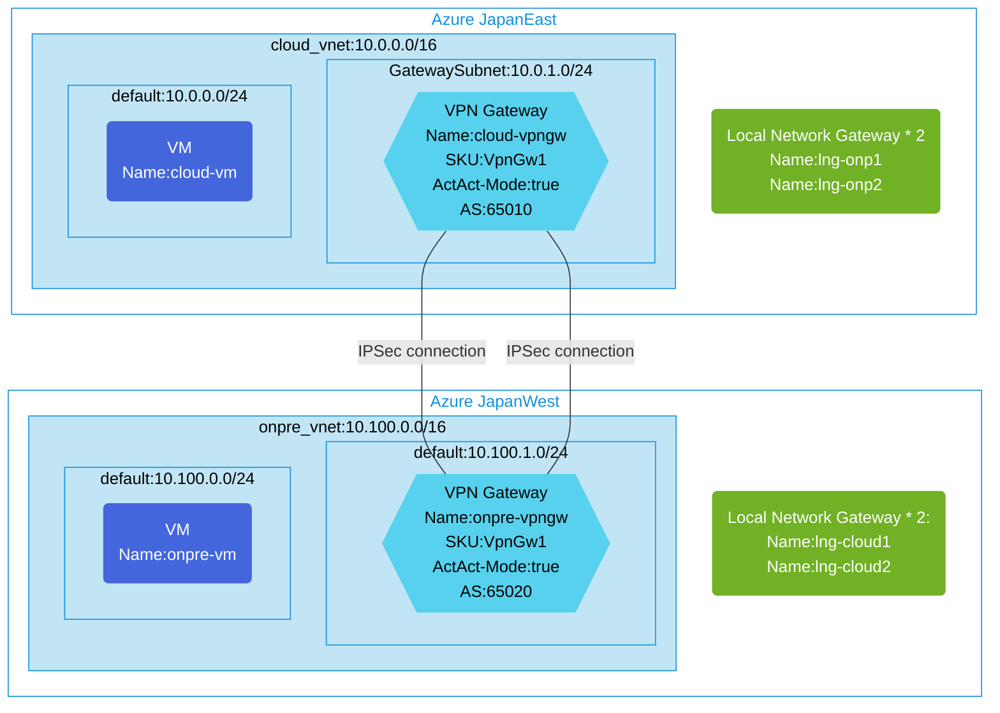

## Architecture
Site-to-Site VPN connection between two Azure regions using Active-Active BGP configuration and Local Network Gateway.



## Features of the template

- Deploys two Azure VPN Gateways in different regions with Active-Active configuration
- Configures BGP for dynamic routing between the VPN gateways (AS: 65010 for cloud, AS: 65020 for on-premises)
- Creates Local Network Gateways to represent the remote networks in each region
- Establishes dual IPsec connections with BGP enabled between the networks for high availability
- Deploys virtual networks in two Azure regions (10.0.0.0/16 in JapanEast and 10.100.0.0/16 in JapanWest)
- Includes a VM in each network for connectivity testing
- Provides option to enable diagnostic logs for the VPN gateways
- Sets up necessary network security groups for secure communication
- Configures appropriate subnet structures including GatewaySubnet for VPN gateways

## Usage

### Prerequisites
- Azure subscription
- Resource group created in supported regions (JapanEast and JapanWest)
- Contributor access to the resource group
- Azure CLI or PowerShell installed for deployment

### Deployment

1. Clone the repository containing the Bicep templates
2. Navigate to the s2s-act-act-vpn-bgp-using-lngw-connction directory
3. Update the parameter.json file with your own values:
   - locationSite1: Azure region for first network (default: japaneast)
   - locationSite2: Azure region for second network (default: japanwest)
   - vmAdminUsername: Username for the VMs
   - vmAdminPassword: Password for the VMs
   - enablediagnostics: Set to true to enable diagnostic logs

4. Deploy using Azure CLI:
   ```bash
   az login
   az group create --name <your-resource-group> --location <location>
   az deployment group create --resource-group <your-resource-group> --template-file main.bicep --parameters parameter.json
   ```

   Or deploy using PowerShell:
   ```powershell
   Connect-AzAccount
   New-AzResourceGroup -Name <your-resource-group> -Location <location>
   New-AzResourceGroupDeployment -ResourceGroupName <your-resource-group> -TemplateFile main.bicep -TemplateParameterFile parameter.json
   ```

5. Verify the deployment in the Azure Portal by checking:
   - The VPN Gateway status and connections in both regions
   - BGP peers and routes in the VPN Gateway configuration
   - Virtual network connectivity between the two regions
   - The VMs in each network can communicate with each other
