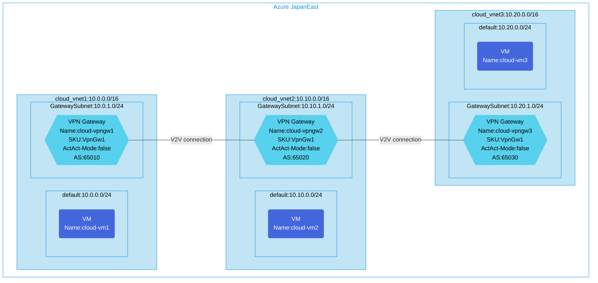

## Architecture
VPN Transit Configuration Between 3 VNets with BGP.



## Features of the template

- Implements a VNet transit topology with three virtual networks connected via VPN Gateways
- Configures site-to-site VPN connections using VNet-to-VNet connections
- Enables BGP routing between VPN gateways with different ASNs:
  - VNet1 Gateway: AS 65010
  - VNet2 Gateway: AS 65020
  - VNet3 Gateway: AS 65030
- Deploys Ubuntu 20.04 virtual machines in each VNet for connectivity testing
- Applies network security groups to protect the virtual networks
- Optionally enables diagnostic logging via Log Analytics
- Creates transit routing through the middle VNet (VNet2) to allow communication between all VNets

## Usage

### Prerequisites
- Azure subscription
- Resource group created in a supported region (JapanEast by default)
- Contributor access to the resource group
- Azure CLI or PowerShell installed for deployment

### Deployment

1. Clone the repository containing the Bicep templates
2. Navigate to the s2s-single-vpn-bgp-using-v2v-connction-3vnet-transition directory
3. Update the parameter.json file with your own values:
   - locationSite1: Azure region for deployment (default: japaneast)
   - vmAdminUsername: Username for the VMs
   - vmAdminPassword: Password for the VMs
   - enablediagnostics: Set to true/false to enable diagnostic logging

4. Deploy using Azure CLI:
   ```bash
   az login
   az group create --name <your-resource-group> --location <location>
   az deployment group create --resource-group <your-resource-group> --template-file main.bicep --parameters parameter.json
   ```

   Or deploy using PowerShell:
   ```powershell
   Connect-AzAccount
   New-AzResourceGroup -Name <your-resource-group> -Location <location>
   New-AzResourceGroupDeployment -ResourceGroupName <your-resource-group> -TemplateFile main.bicep -TemplateParameterFile parameter.json
   ```

5. Verify the deployment in the Azure Portal by checking:
   - The three virtual networks with their respective VPN Gateways
   - The VNet-to-VNet connections between the gateways
   - The BGP configuration on each gateway
   - The virtual machines in each network
   - If enabled, the Log Analytics workspace for diagnostics
