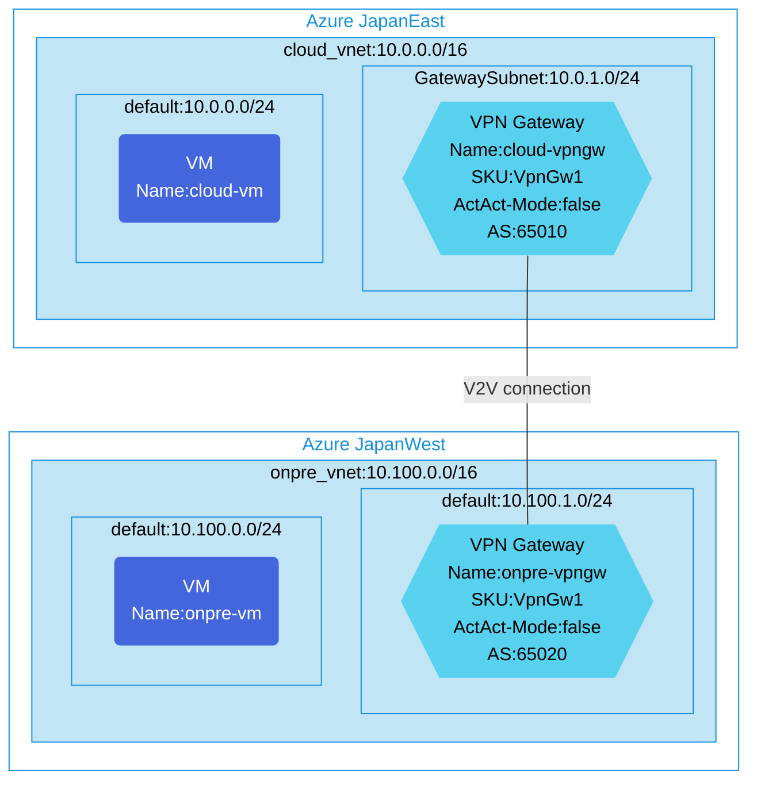

## Architecture
Site-to-Site VPN configuration using BGP with Virtual Network-to-Virtual Network connections.



## Features of the template

- Deploys two virtual networks in separate Azure regions (JapanEast and JapanWest)
- Creates VPN Gateways in each virtual network with BGP enabled
- Configures Site-to-Site VPN connection using VNet-to-VNet connections
- Sets up different BGP ASN numbers for each VPN Gateway (65010 and 65020)
- Deploys Ubuntu VMs in each virtual network for connectivity testing
- Includes Network Security Groups for each virtual network
- Optionally enables diagnostic logging with Log Analytics integration
- Uses single-instance (non-Active-Active) VPN Gateway configuration

## Usage

### Prerequisites
- Azure subscription
- Resource group created in supported regions (JapanEast and JapanWest)
- Contributor access to the resource group
- Azure CLI or PowerShell installed for deployment

### Deployment

1. Clone the repository containing the Bicep templates
2. Navigate to the s2s-single-vpn-bgp-using-v2v-connction directory
3. Update the parameter.json file with your own values:
   - locationSite1: Azure region for first site (default: japaneast)
   - locationSite2: Azure region for second site (default: japanwest)
   - vmAdminUsername: Username for the virtual machines
   - vmAdminPassword: Password for the virtual machines
   - enablediagnostics: Set to true/false to enable diagnostic logging

4. Deploy using Azure CLI:
   ```bash
   az login
   az group create --name <your-resource-group> --location japaneast
   az deployment group create --resource-group <your-resource-group> --template-file main.bicep --parameters parameter.json
   ```

   Or deploy using PowerShell:
   ```powershell
   Connect-AzAccount
   New-AzResourceGroup -Name <your-resource-group> -Location japaneast
   New-AzResourceGroupDeployment -ResourceGroupName <your-resource-group> -TemplateFile main.bicep -TemplateParameterFile parameter.json
   ```

5. Verify the deployment in the Azure Portal by checking:
   - The VPN Gateways in both virtual networks
   - The VNet-to-VNet connections between the gateways
   - The BGP configuration on each VPN Gateway
   - The virtual machines in each network
