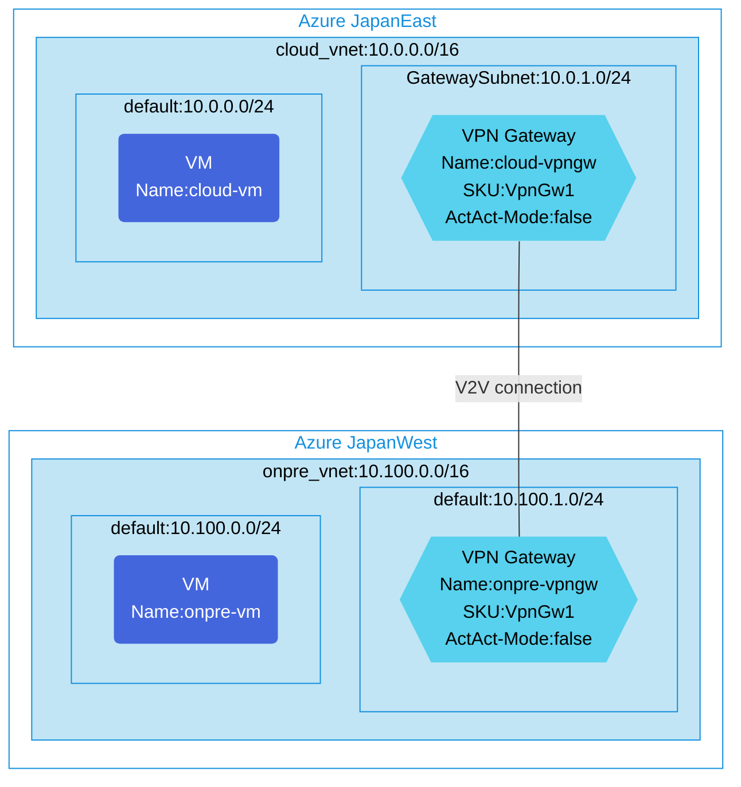

## Architecture
Site-to-Site VPN configuration (Not BGP) using VNet-to-VNet connections.



## Features of the template

- Deploys Site-to-Site VPN connectivity between two Azure regions
- Creates virtual networks in two different regions (JapanEast and JapanWest)
- Configures VPN gateways in each virtual network (SKU: VpnGw1)
- Uses VNet-to-VNet connections for direct connectivity (no BGP routing)
- Creates Ubuntu virtual machines in each VNet for connectivity testing
- Applies network security groups to protect the virtual networks
- Optional diagnostic logging for VPN gateways
- Uses IPsec with pre-shared key for secure communication

## Usage

### Prerequisites
- Azure subscription
- Resource group created in supported regions (JapanEast and JapanWest)
- Contributor access to the resource group
- Azure CLI or PowerShell installed for deployment

### Deployment

1. Clone the repository containing the Bicep templates
2. Navigate to the s2s-single-vpn-nobgp-using-v2v-connction directory
3. Update the parameter.json file with your own values:
   - locationSite1: First Azure region for deployment (default: japaneast)
   - locationSite2: Second Azure region for deployment (default: japanwest)
   - vmAdminUsername: Username for the VMs
   - vmAdminPassword: Password for the VMs
   - enablediagnostics: Set to true/false to enable diagnostic logging

4. Deploy using Azure CLI:
   ```bash
   az login
   az group create --name <your-resource-group> --location <location>
   az deployment group create --resource-group <your-resource-group> --template-file main.bicep --parameters parameter.json
   ```

   Or deploy using PowerShell:
   ```powershell
   Connect-AzAccount
   New-AzResourceGroup -Name <your-resource-group> -Location <location>
   New-AzResourceGroupDeployment -ResourceGroupName <your-resource-group> -TemplateFile main.bicep -TemplateParameterFile parameter.json
   ```

5. Verify the deployment in the Azure Portal by checking:
   - Virtual networks in both regions
   - VPN gateways and their VNet-to-VNet connections
   - Virtual machines in each network
   - Network security group configurations
