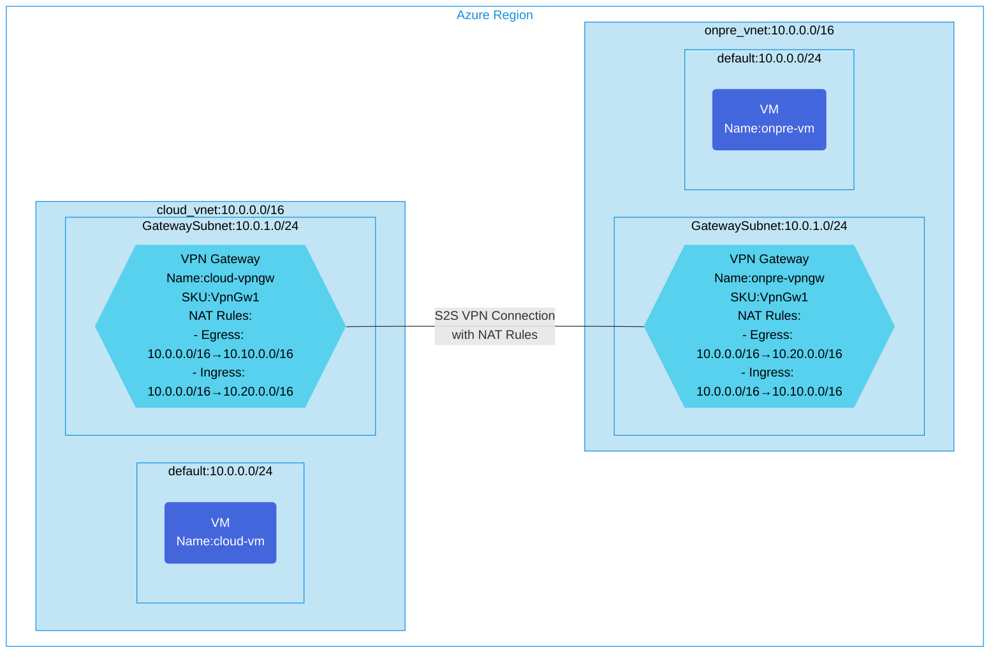

## Architecture
Site-to-Site VPN Configuration with Static NAT for Overlapping IP Address Spaces.



## Features of the template

- Implements Site-to-Site VPN connections between two virtual networks with overlapping IP address spaces
- Configures static NAT rules on both VPN gateways to translate traffic between networks:
  - Cloud VPN Gateway: Egress (10.0.0.0/16 → 10.10.0.0/16) and Ingress (10.0.0.0/16 → 10.20.0.0/16)
  - Onpre VPN Gateway: Egress (10.0.0.0/16 → 10.20.0.0/16) and Ingress (10.0.0.0/16 → 10.10.0.0/16)
- Deploys Ubuntu 20.04 virtual machines in each network for connectivity testing
- Applies network security groups to protect the virtual networks
- Enables communication between networks with identical IP address ranges using address translation
- Optionally enables diagnostic logging via Log Analytics

## Usage

### Prerequisites
- Azure subscription
- Resource group created in a supported region (JapanEast by default)
- Contributor access to the resource group
- Azure CLI or PowerShell installed for deployment

### Deployment

1. Clone the repository containing the Bicep templates
2. Navigate to the s2s-vpn-static-nat directory
3. Update the parameter.json file with your own values:
   - locationSite1: Azure region for deployment (default: japaneast)
   - vmAdminUsername: Username for the VMs
   - vmAdminPassword: Password for the VMs
   - enablediagnostics: Set to true/false to enable diagnostic logging

4. Deploy using Azure CLI:
   ```bash
   az login
   az group create --name <your-resource-group> --location <location>
   az deployment group create --resource-group <your-resource-group> --template-file main.bicep --parameters parameter.json
   ```

   Or deploy using PowerShell:
   ```powershell
   Connect-AzAccount
   New-AzResourceGroup -Name <your-resource-group> -Location <location>
   New-AzResourceGroupDeployment -ResourceGroupName <your-resource-group> -TemplateFile main.bicep -TemplateParameterFile parameter.json
   ```

5. Verify the deployment in the Azure Portal by checking:
   - The two virtual networks with their respective VPN Gateways
   - The NAT rules configured on each VPN gateway
   - The site-to-site VPN connections with NAT rules applied
   - The virtual machines in each network
   - If enabled, the Log Analytics workspace for diagnostics