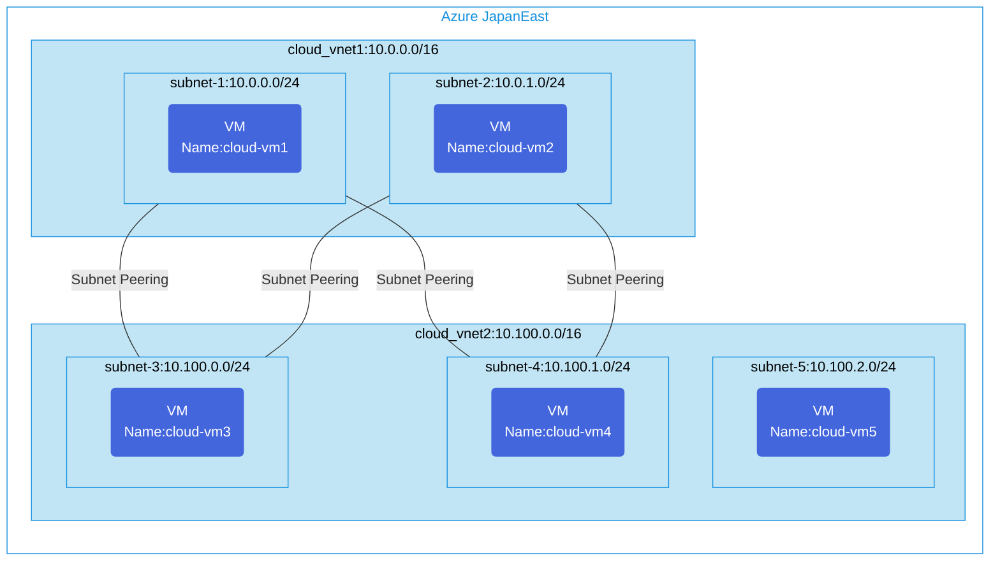

Simple subnet peering configuration

```mermaid
graph LR;
%% Groups and Services
subgraph GR1[Azure JapanEast]
  subgraph GV1[cloud_vnet1:10.0.0.0/16]
      subgraph GVS2[subnet-2:10.0.1.0/24]
        CP2("VM<br/>Name:cloud-vm2")
      end
      subgraph GVS1[subnet-1:10.0.0.0/24]
        CP1("VM<br/>Name:cloud-vm1")
      end
end
  subgraph GV2[cloud_vnet2:10.100.0.0/16]
      subgraph GVS3[subnet-5:10.100.2.0/24]
        CP3("VM<br/>Name:cloud-vm5")
      end
      subgraph GVS4[subnet-4:10.100.1.0/24]
        CP4("VM<br/>Name:cloud-vm4")
      end
      subgraph GVS5[subnet-3:10.100.0.0/24]
        CP5("VM<br/>Name:cloud-vm3")
      end
end
end

%% Relation for resources
GVS1 --Subnet Peering--- GVS5
GVS1 --Subnet Peering--- GVS4
GVS2 --Subnet Peering--- GVS5
GVS2 --Subnet Peering--- GVS4

%% Groups style
classDef GSR fill:#fff,color:#1490df,stroke:#1490df
class GR1,GR2 GSR

classDef SGV1 fill:#c1e5f5,color:#000,stroke:#1490df
class GV1,GV2,GV3,GVS1,GVS2,GVS3,GVS4,GVS5 SGV1
 
%% Service Style
classDef SCP fill:#4466dd,color:#fff,stroke:none
class CP1,CP2,CP3,CP4,CP5 SCP


```
