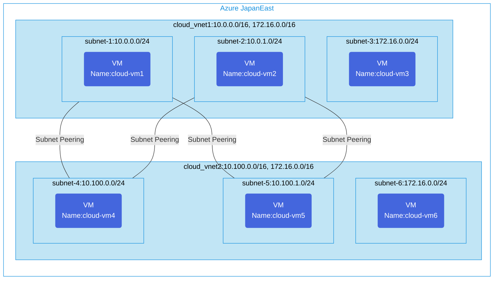

## Architecture
Configuration of subnet-level peering between two virtual networks in Azure.



## Features of the template

- Deploys two virtual networks (VNets) with multiple subnets in each
- Creates subnet-level peering between selected subnets across VNets
- Deploys Ubuntu 20.04 virtual machines in each subnet for connectivity testing
- Configures Network Security Groups to protect the virtual networks
- Enables selective subnet connectivity without exposing all resources
- All resources are deployed in a single Azure region (Japan East)
- Uses Azure's standard virtual network peering with subnet-level restrictions

## Usage

### Prerequisites
- Azure subscription
- Resource group created in a supported region
- Contributor access to the resource group
- Azure CLI or PowerShell installed for deployment

### Deployment

1. Clone the repository containing the Bicep templates
2. Navigate to the simple-subnetpeering directory
3. Update the parameter.json file with your own values:
   - locationSite1: Azure region for deployment (default: japaneast)
   - vmAdminUsername: Username for the VMs
   - vmAdminPassword: Password for the VMs

4. Deploy using Azure CLI:
   ```bash
   az login
   az group create --name <your-resource-group> --location <location>
   az deployment group create --resource-group <your-resource-group> --template-file main.bicep --parameters parameter.json
   ```

   Or deploy using PowerShell:
   ```powershell
   Connect-AzAccount
   New-AzResourceGroup -Name <your-resource-group> -Location <location>
   New-AzResourceGroupDeployment -ResourceGroupName <your-resource-group> -TemplateFile main.bicep -TemplateParameterFile parameter.json
   ```

5. Verify the deployment in the Azure Portal by checking:
   - The virtual networks and their subnet configurations
   - The subnet peering connections between VNets
   - The virtual machines in each subnet
   - Network security groups applied to the subnets
