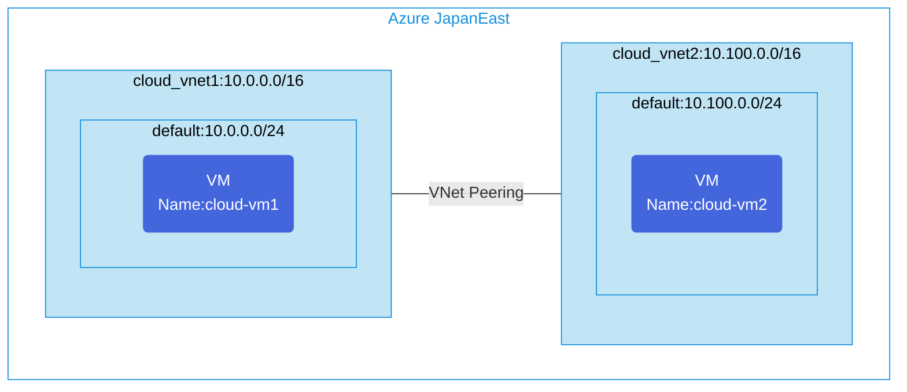

## Architecture
Simple Virtual Network Peering configuration between two VNets.



## Features of the template

- Deploys two virtual networks in the same Azure region
- Configures VNet peering between networks to allow communication
- Deploys Ubuntu virtual machines in each network for connectivity testing
- Sets up network security groups to protect virtual networks
- Enables bidirectional communication between the peered networks
- Allows forwarded traffic between networks

## Usage

### Prerequisites
- Azure subscription
- Resource group created in a supported region (Japan East)
- Contributor access to the resource group
- Azure CLI or PowerShell installed for deployment

### Deployment

1. Clone the repository containing the Bicep templates
2. Navigate to the simple-vnetpeering directory
3. Update the parameter.json file with your own values:
   - locationSite1: Azure region for deployment (default: japaneast)
   - vmAdminUsername: Username for the VMs
   - vmAdminPassword: Password for the VMs

4. Deploy using Azure CLI:
   ```bash
   az login
   az group create --name <your-resource-group> --location <location>
   az deployment group create --resource-group <your-resource-group> --template-file main.bicep --parameters parameter.json
   ```

   Or deploy using PowerShell:
   ```powershell
   Connect-AzAccount
   New-AzResourceGroup -Name <your-resource-group> -Location <location>
   New-AzResourceGroupDeployment -ResourceGroupName <your-resource-group> -TemplateFile main.bicep -TemplateParameterFile parameter.json
   ```

5. Verify the deployment in the Azure Portal by checking:
   - The two virtual networks
   - VNet peering configuration between networks
   - The virtual machines in each network
   - Network connectivity between VMs