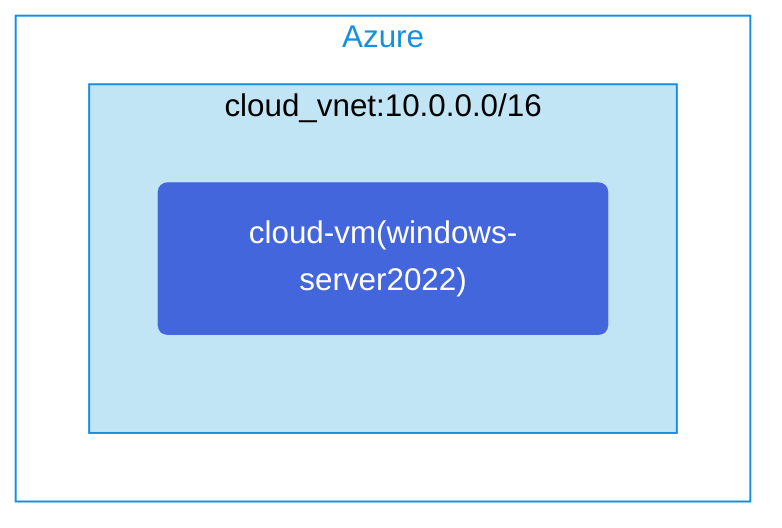

It's a simple bicep that deploys windows server 2022 in an Azure VNet 

```mermaid
graph TB;
%% Groups and Services

subgraph GA[Azure]
  subgraph GV[cloud_vnet:10.0.0.0/16]
    CP("cloud-vm(windows-server2022)")
  end
end

%% Groups style
classDef SGA fill:#fff,color:#1490df,stroke:#1490df
class GA SGA

classDef SGV fill:#c1e5f5,color:#000,stroke:#1490df
class GV SGV
 
%% Service Style
classDef SCP fill:#4466dd,color:#fff,stroke:none
class CP SCP

```
