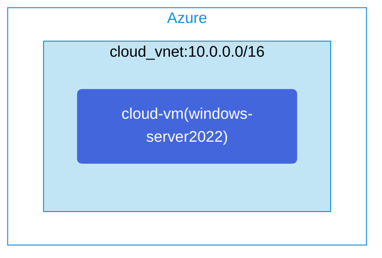

## Architecture
Simple Windows Server 2022 VM deployment in an Azure Virtual Network.



## Features of the template

- Deploys a Windows Server 2022 virtual machine in Azure
- Creates a virtual network with address space 10.0.0.0/16
- Configures a network security group for VM protection
- Assigns a public IP address for remote access
- Deploys the VM in a single subnet (10.0.0.0/24)

## Usage

### Prerequisites
- Azure subscription
- Resource group created in a supported region
- Contributor access to the resource group
- Azure CLI or PowerShell installed for deployment

### Deployment

1. Clone the repository containing the Bicep templates
2. Navigate to the simple-windowsserver2022 directory
3. Update the parameter.json file with your own values:
   - locationSite1: Azure region for deployment (default: japaneast)
   - vmAdminUsername: Username for the Windows Server VM
   - vmAdminPassword: Password for the Windows Server VM

4. Deploy using Azure CLI:
   ```bash
   az login
   az group create --name <your-resource-group> --location <location>
   az deployment group create --resource-group <your-resource-group> --template-file main.bicep --parameters parameter.json
   ```

   Or deploy using PowerShell:
   ```powershell
   Connect-AzAccount
   New-AzResourceGroup -Name <your-resource-group> -Location <location>
   New-AzResourceGroupDeployment -ResourceGroupName <your-resource-group> -TemplateFile main.bicep -TemplateParameterFile parameter.json
   ```

5. Verify the deployment in the Azure Portal by checking:
   - The virtual network configuration
   - The Windows Server 2022 VM deployment
   - The network security group settings
   - The public IP address assigned to the VM
