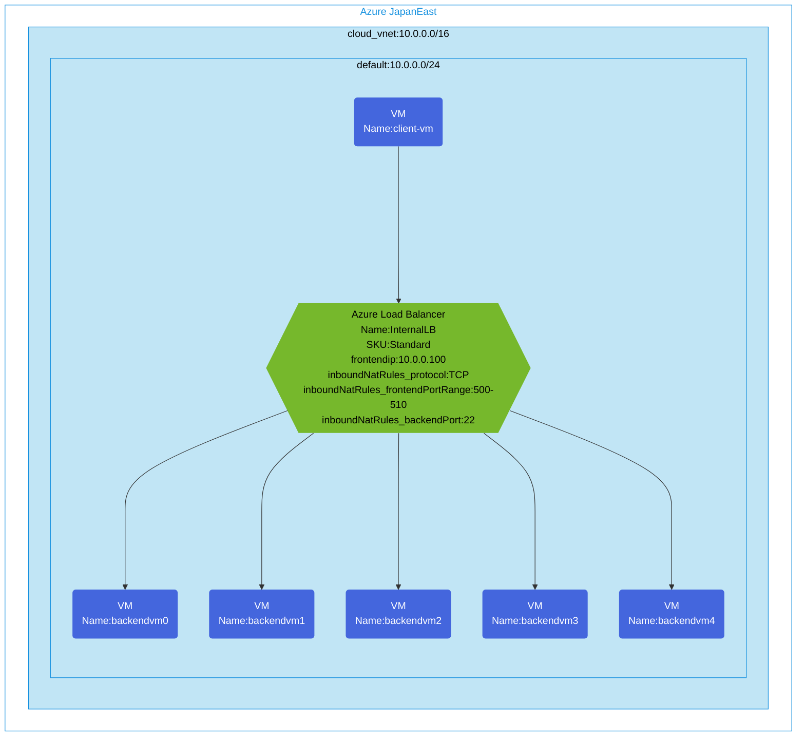

## Architecture
Configuring access to VMs via Standard SKU internal Load Balancer with inbound NAT rules.



## Features of the template

- Deploys a Standard SKU internal Azure Load Balancer with private frontend IP (10.0.0.100)
- Configures inbound NAT rules with port range (500-510) mapped to backend port 22 (SSH)
- Creates 5 backend virtual machines in a backend pool
- Creates a client VM with public IP for testing the load balancer from within the VNet
- All resources are deployed in a single virtual network with appropriate subnet
- Uses a network security group to protect the subnet

## Usage

### Prerequisites
- Azure subscription
- Resource group created in a supported region
- Contributor access to the resource group
- Azure CLI or PowerShell installed for deployment

### Deployment

1. Clone the repository containing the Bicep templates
2. Navigate to the standard-internal-lb-inbound-nat directory
3. Update the parameter.bicepparam file with your own values:
   - locationSite1: Azure region for deployment (default: japaneast)
   - vmAdminUsername: Username for the VMs
   - vmAdminPassword: Password for the VMs

4. Deploy using Azure CLI:
   ```bash
   az login
   az group create --name <your-resource-group> --location <location>
   az deployment group create --resource-group <your-resource-group> --template-file main.bicep --parameters parameter.bicepparam
   ```

   Or deploy using PowerShell:
   ```powershell
   Connect-AzAccount
   New-AzResourceGroup -Name <your-resource-group> -Location <location>
   New-AzResourceGroupDeployment -ResourceGroupName <your-resource-group> -TemplateFile main.bicep -TemplateParameterFile parameter.bicepparam
   ```

5. Verify the deployment in the Azure Portal by checking:
   - The internal load balancer configuration
   - The inbound NAT rules configuration with port range
   - Backend pool with the five backend VMs
   - The client VM and its ability to connect to backend VMs via the load balancer