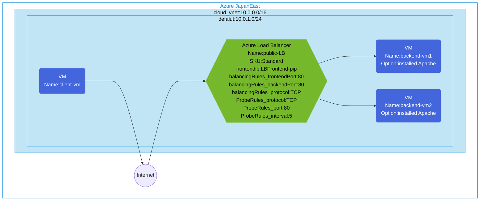

## Architecture
Configuring access to a VM with Apache installed via Standard SKU Public ALB.



## Features of the template

- Deploys a Standard SKU public Azure Load Balancer with public frontend IP
- Creates 2 backend virtual machines with Apache web server installed
- Configures TCP load balancing rules for port 80
- Sets up health probe to monitor backend server availability
- Creates a client VM for testing the load balancer
- All resources are deployed in a single virtual network with appropriate subnet
- Uses Standard SKU which supports availability zones for high availability

## Usage

### Prerequisites
- Azure subscription
- Resource group created in a supported region
- Contributor access to the resource group
- Azure CLI or PowerShell installed for deployment

### Deployment

1. Clone the repository containing the Bicep templates
2. Navigate to the standard-public-lb-apache directory
3. Update the parameter.json file with your own values:
   - locationSite1: Azure region for deployment (default: japaneast)
   - vmAdminUsername: Username for the VMs
   - vmAdminPassword: Password for the VMs

4. Deploy using Azure CLI:
   ```bash
   az login
   az group create --name <your-resource-group> --location <location>
   az deployment group create --resource-group <your-resource-group> --template-file main.bicep --parameters parameter.json
   ```

   Or deploy using PowerShell:
   ```powershell
   Connect-AzAccount
   New-AzResourceGroup -Name <your-resource-group> -Location <location>
   New-AzResourceGroupDeployment -ResourceGroupName <your-resource-group> -TemplateFile main.bicep -TemplateParameterFile parameter.json
   ```

5. Verify the deployment in the Azure Portal by checking:
   - The public load balancer configuration
   - Backend pool with the two Apache VMs
   - Health probe settings
   - Load balancing rules
   - Public IP assigned to the load balancer
