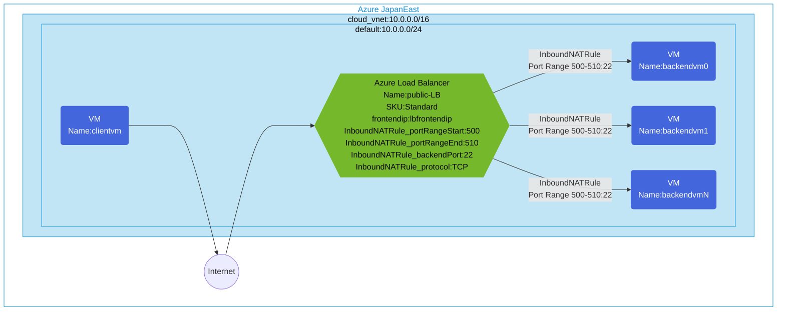

## Architecture
Configuring access to backend VMs via Standard SKU Public Load Balancer with Inbound NAT Rules.



## Features of the template

- Deploys a Standard SKU public Azure Load Balancer with public frontend IP
- Configures Inbound NAT Rules to map frontend port range (500-510) to backend port 22
- Creates a backend pool for multiple VMs
- Deploys multiple backend VMs (default: 5) in the backend pool
- Creates a client VM with public IP for testing
- All resources are deployed in a single virtual network with appropriate subnet
- Uses Network Security Group to protect the subnet

## Usage

### Prerequisites
- Azure subscription
- Resource group created in a supported region
- Contributor access to the resource group
- Azure CLI or PowerShell installed for deployment

### Deployment

1. Clone the repository containing the Bicep templates
2. Navigate to the standard-public-lb-inbound-nat directory
3. Update the parameter.bicepparam file with your own values:
   - locationSite1: Azure region for deployment (default: japaneast)
   - vmAdminUsername: Username for the VMs
   - vmAdminPassword: Password for the VMs

4. Deploy using Azure CLI:
   ```bash
   az login
   az group create --name <your-resource-group> --location <location>
   az deployment group create --resource-group <your-resource-group> --template-file main.bicep --parameters parameter.bicepparam
   ```

   Or deploy using PowerShell:
   ```powershell
   Connect-AzAccount
   New-AzResourceGroup -Name <your-resource-group> -Location <location>
   New-AzResourceGroupDeployment -ResourceGroupName <your-resource-group> -TemplateFile main.bicep -TemplateParameterFile parameter.bicepparam
   ```

5. Verify the deployment in the Azure Portal by checking:
   - The public load balancer configuration with Standard SKU
   - Backend pool with multiple VMs
   - Inbound NAT rules configuration with port range (500-510) to port 22
   - Connectivity to backend VMs using SSH through the load balancer's public IP and port ranges