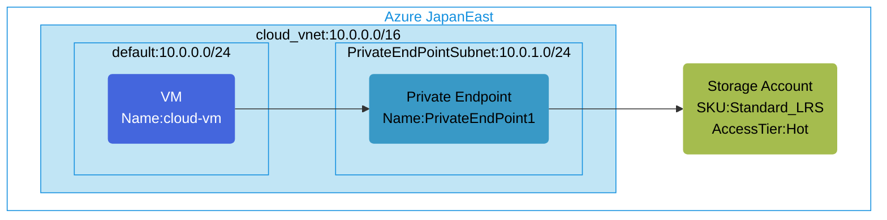

## Architecture
Configuration of a storage account with private endpoint for secure access from a virtual network.



## Features of the template

- Deploys a storage account with private endpoint for secure access
- Creates a virtual network with two subnets (default and PrivateEndPointSubnet)
- Configures a private endpoint in a dedicated subnet to access storage
- Deploys a Ubuntu 20.04 VM for testing connectivity to storage
- Enables secure access to blob storage services via private network
- Applies network security group to protect the virtual network
- Eliminates exposure of storage services to the public internet
- All resources are deployed in a single Azure region (Japan East)

## Usage

### Prerequisites
- Azure subscription
- Resource group created in a supported region
- Contributor access to the resource group
- Azure CLI or PowerShell installed for deployment

### Deployment

1. Clone the repository or download the required files:
   - main.bicep
   - parameter.json

2. Modify the parameter.json file to set:
   - Storage account name (must be globally unique)
   - Virtual machine admin credentials
   - Location (default is Japan East)

3. Deploy using Azure CLI:
   ```
   az group deployment create --resource-group <your-resource-group> --template-file main.bicep --parameters parameter.json
   ```

4. After successful deployment, you will have:
   - A virtual network with two subnets
   - A storage account with private endpoint configuration
   - An Ubuntu VM that can access the storage via private endpoint
   - The private endpoint with a network interface in the PrivateEndPointSubnet