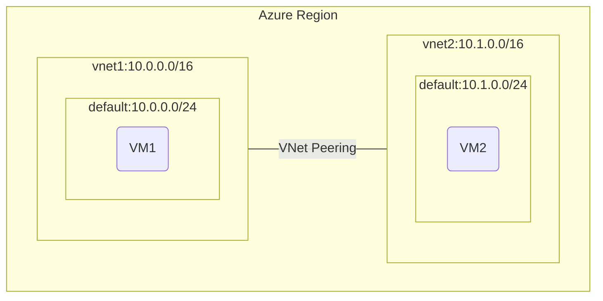

# Two VNets with VMs and VNet Peering

This template deploys a simple topology with two virtual networks connected by VNet peering, and one virtual machine in each VNet.

## Architecture



## Resources Deployed

- 2 Virtual Networks with peering configured between them
- 1 Network Security Group applied to both subnets
- 2 Ubuntu 20.04 Virtual Machines (one in each VNet)
- 2 Public IP addresses (one for each VM)

## Prerequisites

- An Azure subscription
- Resource group created

## Parameters

| Parameter | Type | Description |
|-----------|------|-------------|
| locationSite1 | string | Location for all resources (e.g., japaneast) |
| vmAdminUsername | string | Admin username for VMs |
| vmAdminPassword | securestring | Admin password for VMs |

## Deployment Steps

### Azure CLI

```bash
az group create --name MyResourceGroup --location japaneast

# When using parameters file
az deployment group create --resource-group MyResourceGroup --template-file main.bicep --parameters parameters.json

# Or specify parameters directly
az deployment group create --resource-group MyResourceGroup --template-file main.bicep --parameters locationSite1=japaneast vmAdminUsername=azureuser vmAdminPassword=YourSecurePassword123!
```

### PowerShell

```powershell
New-AzResourceGroup -Name MyResourceGroup -Location japaneast

# When using parameters file
New-AzResourceGroupDeployment -ResourceGroupName MyResourceGroup -TemplateFile main.bicep -TemplateParameterFile parameters.json

# Or specify parameters directly
New-AzResourceGroupDeployment -ResourceGroupName MyResourceGroup -TemplateFile main.bicep -locationSite1 japaneast -vmAdminUsername azureuser -vmAdminPassword (ConvertTo-SecureString -String 'YourSecurePassword123!' -AsPlainText -Force)
```

## Testing Connectivity

After deployment, you can test connectivity between the two VMs. Both VMs have public IPs for easy access. SSH into any VM and try to ping or connect to the other VM's private IP address.

For example:
```bash
# SSH into VM1
ssh azureuser@vm1_public_ip

# Test connectivity to VM2
ping <VM2_PRIVATE_IP>
```

## Notes

- Both VMs are deployed with public IPs for easy management. For production, consider removing public IPs and using a bastion host.
- The default Network Security Group allows SSH access from any source. Restrict this to your IP address for production use.