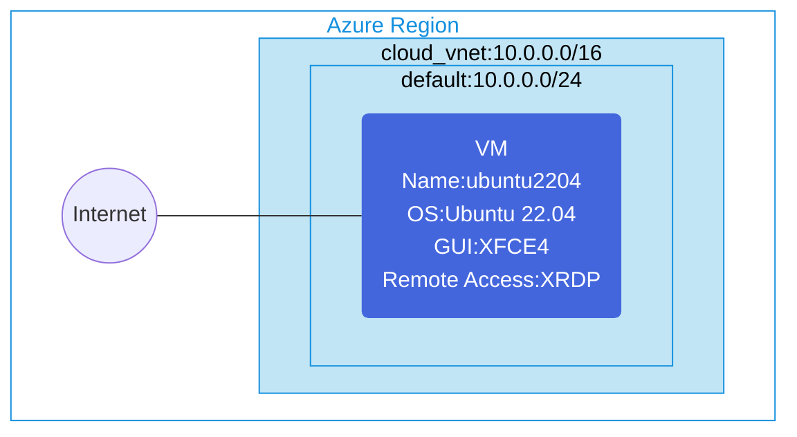

## Architecture
Ubuntu GUI client VM for Point-to-Site VPN connections.



## Features of the template

- Deploys an Ubuntu 22.04 virtual machine with GUI interface (XFCE4)
- Configures XRDP for remote desktop access
- Creates a virtual network with a default subnet
- Provisions a public IP address for remote access from the internet
- Sets up network security group for secure communication
- Designed to be used as a client for Point-to-Site VPN connections
- Uses cloud-init for automated GUI and XRDP installation
- Ready-to-use environment for testing and accessing Azure P2S VPN gateways

## Usage

### Prerequisites
- Azure subscription
- Resource group created in a supported region
- Contributor access to the resource group
- Azure CLI or PowerShell installed for deployment

### Deployment

1. Clone the repository containing the Bicep templates
2. Navigate to the ubuntu-gui-client-for-p2svpn directory
3. Update the parameter.json file with your own values:
   - locationSite1: Azure region for deployment
   - vmAdminUsername: Username for the VM
   - vmAdminPassword: Password for the VM

4. Deploy using Azure CLI:
   ```bash
   az login
   az group create --name <your-resource-group> --location <location>
   az deployment group create --resource-group <your-resource-group> --template-file main.bicep --parameters parameter.json
   ```

   Or deploy using PowerShell:
   ```powershell
   Connect-AzAccount
   New-AzResourceGroup -Name <your-resource-group> -Location <location>
   New-AzResourceGroupDeployment -ResourceGroupName <your-resource-group> -TemplateFile main.bicep -TemplateParameterFile parameter.json
   ```

5. After deployment, you can access the VM using an RDP client:
   - Connect to the VM's public IP address using port 3389
   - Login with the username and password provided during deployment
   - The XFCE4 desktop environment will be available for configuring and connecting to Point-to-Site VPN

6. To configure a Point-to-Site VPN connection:
   - Download the VPN client configuration files from your Azure VPN Gateway
   - Install and configure the VPN client on the Ubuntu VM
   - Connect to your Azure VPN Gateway using the provided credentials