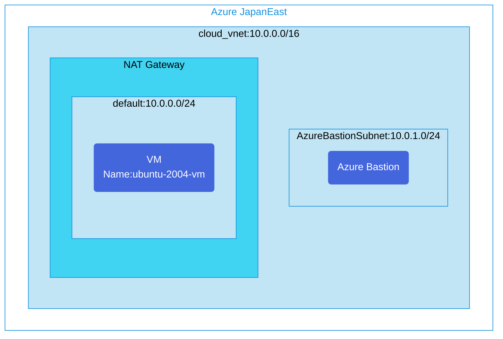

## Architecture
Simple environment with a NAT Gateway for outbound internet connectivity.



## Features of the template

- Deploys an Azure NAT Gateway for centralized outbound internet connectivity
- Creates a virtual network with two subnets:
  - Default subnet with NAT Gateway association
  - Azure Bastion subnet for secure VM access
- Deploys an Ubuntu VM in the default subnet
- Configures Azure Bastion for secure remote access
- Applies Network Security Group to protect the subnet

## Usage

### Prerequisites
- Azure subscription
- Resource group created in a supported region
- Contributor access to the resource group
- Azure CLI or PowerShell installed for deployment

### Deployment

1. Clone the repository containing the Bicep templates
2. Navigate to the vm-nat-gateway directory
3. Update the parameter.json file with your own values:
   - locationSite1: Azure region for deployment (default: japaneast)
   - vmAdminUsername: Username for the VM
   - vmAdminPassword: Password for the VM

4. Deploy using Azure CLI:
   ```bash
   az login
   az group create --name <your-resource-group> --location <location>
   az deployment group create --resource-group <your-resource-group> --template-file main.bicep --parameters parameter.json
   ```

   Or deploy using PowerShell:
   ```powershell
   Connect-AzAccount
   New-AzResourceGroup -Name <your-resource-group> -Location <location>
   New-AzResourceGroupDeployment -ResourceGroupName <your-resource-group> -TemplateFile main.bicep -TemplateParameterFile parameter.json
   ```

5. Verify the deployment in the Azure Portal by checking:
   - The virtual network with its subnets
   - The NAT Gateway configuration
   - The VM deployment and network configuration
   - Azure Bastion service
