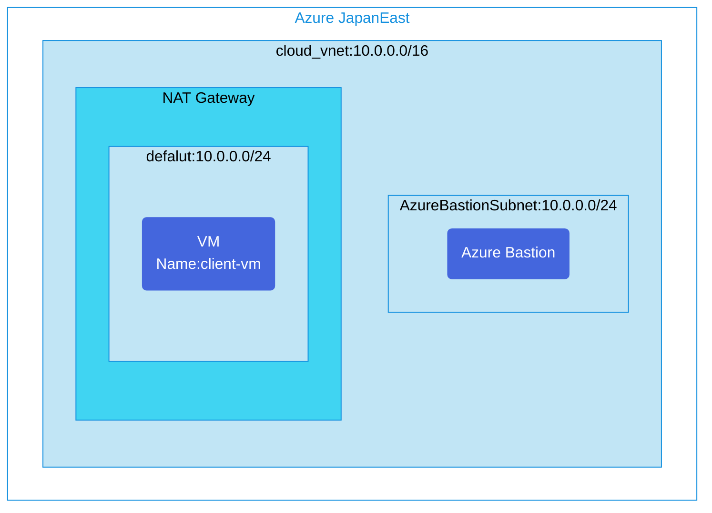

Nat Gateway test Environment.

```mermaid
graph TB;
%% Groups and Services
subgraph GR1[Azure JapanEast]
  subgraph GV1[cloud_vnet:10.0.0.0/16]
      subgraph GVS2[AzureBastionSubnet:10.0.0.0/24]
        CP3("Azure Bastion")
      end
      subgraph NAT[NAT Gateway]
        subgraph GVS1[defalut:10.0.0.0/24]
          CP1("VM<br/>Name:client-vm")
        end
      end
  end
end

%% Relation for resources

%% Groups style
classDef GSR fill:#fff,color:#1490df,stroke:#1490df
class GR1,GR2 GSR

classDef SGV1 fill:#c1e5f5,color:#000,stroke:#1490df
class GV1,GVS1,GVS2,GVS3,GVS4 SGV1

classDef SGNAT fill:#40d4f2,color:#000,stroke:#1490df
class NAT SGNAT

classDef SGV2 fill:#c1e5f5,color:#000,stroke:#1490df
class GV2 SGV2
 
%% Service Style
classDef SCP fill:#4466dd,color:#fff,stroke:none
class CP1,CP2,CP3 SCP

```
