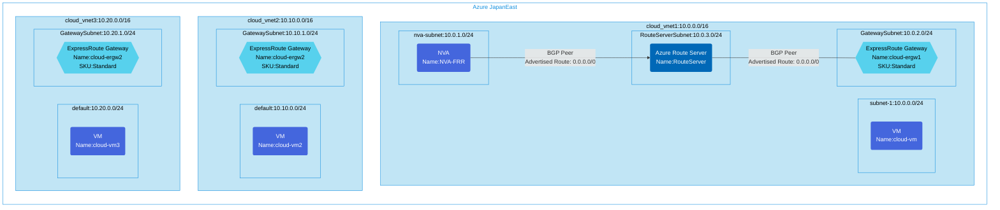

## Architecture
Transit configuration of VNet-to-VNet connectivity using ExpressRoute Circuit with forced tunneling through NVA. This template deploys the Azure-side resources only (excludes ExpressRoute circuit resources).



## Features of the template

- Deploys three virtual networks with ExpressRoute gateways for transit connectivity
- Configures a Network Virtual Appliance (NVA) using FRRouting for traffic control
- Sets up Azure Route Server for BGP route propagation
- Configures forced tunneling by advertising a default route (0.0.0.0/0) from the NVA
- Deploys virtual machines in each VNet for connectivity testing
- Creates appropriate subnets for gateway, NVA, and VM deployments
- Applies network security groups to protect virtual networks

## Usage

### Prerequisites
- Azure subscription
- Resource group created in a supported region
- ExpressRoute circuit (not included in this template)
- Contributor access to the resource group
- Azure CLI or PowerShell installed for deployment

### Deployment

1. Clone the repository containing the Bicep templates
2. Navigate to the vnet2vnet-msee-transit directory
3. Update the parameter.json file with your own values:
   - locationSite1: Azure region for deployment (default: japaneast)
   - vmAdminUsername: Username for the VMs and NVA
   - vmAdminPassword: Password for the VMs and NVA
   - enablediagnostics: Boolean to enable/disable diagnostics

4. Deploy using Azure CLI:
   ```bash
   az login
   az group create --name <your-resource-group> --location <location>
   az deployment group create --resource-group <your-resource-group> --template-file main.bicep --parameters parameter.json
   ```

   Or deploy using PowerShell:
   ```powershell
   Connect-AzAccount
   New-AzResourceGroup -Name <your-resource-group> -Location <location>
   New-AzResourceGroupDeployment -ResourceGroupName <your-resource-group> -TemplateFile main.bicep -TemplateParameterFile parameter.json
   ```

5. Verify the deployment in the Azure Portal by checking:
   - The three virtual networks and their subnets
   - The ExpressRoute gateways in each VNet
   - The NVA in the first VNet
   - Azure Route Server configuration
   - The virtual machines in each network
