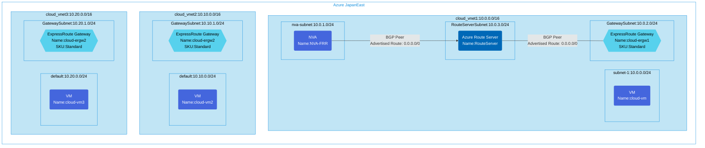

Transit configuration of Vnet2Vnet using ExpressRoute Circuit.(Excludes ExpressRoute resources)
To testing the forced tunneling configuration, I also prepared a VNet to advertise the default route from the NVA.

