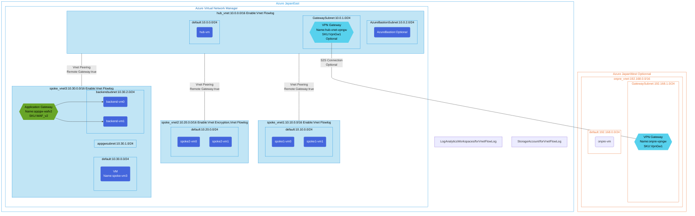

## Architecture
Hub-Spoke network configuration with VNet Flow Logs for network traffic monitoring.



## Features of the template

- Deploys a hub-spoke network architecture with VNet Flow Logs
- Creates a hub VNet with three spoke VNets connected via VNet peering
- Configures VNet Flow Logs for network traffic monitoring
- Integrates with Azure Virtual Network Manager
- Deploys a WAF v2 Application Gateway in spoke_vnet3
- Enables VNet encryption on spoke_vnet2 for enhanced security
- Sets up Log Analytics Workspace to analyze flow logs data
- Creates a Storage Account for storing flow logs
- Provides optional VPN Gateway configuration for site-to-site connectivity
- Includes optional Azure Bastion for secure VM access
- Deploys multiple VMs across different networks for testing connectivity

## Usage

### Prerequisites

- Azure subscription
- Resource group created in a supported region
- Contributor access to the resource group
- Azure CLI or PowerShell installed for deployment

### Deployment

1. Clone the repository containing the Bicep templates
2. Navigate to the vnetflowlog-env directory
3. Update the parameter file with your own values:
   - locationSite1: Primary Azure region for deployment (default: japaneast)
   - locationSite2: Secondary Azure region for deployment (default: japanwest)
   - vmAdminUsername: Username for the VMs
   - vmAdminPassword: Password for the VMs
   - deployBastion: Set to true/false to deploy Azure Bastion
   - deployVpnGateway: Set to true/false to deploy VPN Gateways

4. Deploy using Azure CLI:
   ```bash
   az login
   az group create --name <your-resource-group> --location <location>
   az deployment group create --resource-group <your-resource-group> --template-file main.bicep --parameters parameter.json
   ```

   Or deploy using PowerShell:
   ```powershell
   Connect-AzAccount
   New-AzResourceGroup -Name <your-resource-group> -Location <location>
   New-AzResourceGroupDeployment -ResourceGroupName <your-resource-group> -TemplateFile main.bicep -TemplateParameterFile parameter.json
   ```

5. Verify the deployment in the Azure Portal by checking:
   - The hub and spoke virtual networks and their peering configurations
   - VNet Flow Logs settings on the virtual networks
   - The Application Gateway deployment in spoke_vnet3
   - The storage account for flow logs
   - The Log Analytics workspace for flow log analysis
   - The virtual machines across different networks
